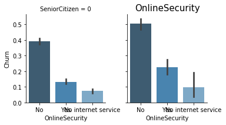

# Telco churn analysis

This notebook will complete an exploratory data analysis on the telco churn [dataset](https://www.kaggle.com/blastchar/telco-customer-churn) followed by feature engineering for modelling. 

There are some extra cells at the end that show how this data set can be clustered and what the results can tell us about the customers in each group.


```python
# import necessary packages for the EDA

# pandas for dataframes and numpy for linear algebra and matrices
import pandas as pd
import numpy as np

#standard plotting
import matplotlib.pyplot as plt
import seaborn as sns

pd.set_option('display.max_columns',99)


import warnings
warnings.filterwarnings('ignore')


from sklearn.preprocessing import LabelEncoder
```


```python
#telco dataset
telco = pd.read_csv('WA_Fn-UseC_-Telco-Customer-Churn.csv')
```

# Exploratory Data Analysis (EDA)

Before diving into the dataset, it's always import to look at the read.me file to see if there are explanations for each feature. Thankfully, this is one of the datasets that does have that:

1. customerID : Customer ID
2. gender : Whether the customer is a male or a female
3. SeniorCitizen : Whether the customer is a senior citizen or not (1, 0)
4. Partner : Whether the customer has a partner or not (Yes, No)
5. Dependents : Whether the customer has dependents or not (Yes, No)
6. tenure : Number of months the customer has stayed with the company
7. PhoneService : Whether the customer has a phone service or not (Yes, No)
8. MultipleLines : Whether the customer has multiple lines or not (Yes, No, No phone service)
9. InternetService : Customer’s internet service provider (DSL, Fiber optic, No)
10. OnlineSecurity : Whether the customer has online security or not (Yes, No, No internet service)
11. OnlineBackup : Whether the customer has online backup or not (Yes, No, No internet service)
12. DeviceProtection : Whether the customer has device protection or not (Yes, No, No internet service)
13. TechSupport : Whether the customer has tech support or not (Yes, No, No internet service)
14. StreamingTV : Whether the customer has streaming TV or not (Yes, No, No internet service)
15. StreamingMovies : Whether the customer has streaming movies or not (Yes, No, No internet service)
16. Contract : The contract term of the customer (Month-to-month, One year, Two year)
17. PaperlessBilling : Whether the customer has paperless billing or not (Yes, No)
18. PaymentMethod : The customer’s payment method (Electronic check, Mailed check, Bank transfer (automatic), Credit card (automatic))
19. MonthlyCharges : The amount charged to the customer monthly
20. TotalCharges : The total amount charged to the customer
21. Churn : Whether the customer churned or not (Yes or No)


There are 21 total features, the last being "Churn" which is a binomial (Yes/No) and will be used as the target for predicting.

Furthermore, of the remaining variables, only 3 are numerical (tenure, TotalCharges, MonthlyCharges). The other 17 are boolean (1/0, yes/no) or categorical, such as Internet Service (DSL, Fiber Optic, No).

Now let's dig in


```python
#data size and list of data types
print(f'Data Size: {telco.shape}')
print(f'Data Types: {telco.dtypes}')
```

    Data Size: (7043, 21)
    Data Types: customerID           object
    gender               object
    SeniorCitizen         int64
    Partner              object
    Dependents           object
    tenure                int64
    PhoneService         object
    MultipleLines        object
    InternetService      object
    OnlineSecurity       object
    OnlineBackup         object
    DeviceProtection     object
    TechSupport          object
    StreamingTV          object
    StreamingMovies      object
    Contract             object
    PaperlessBilling     object
    PaymentMethod        object
    MonthlyCharges      float64
    TotalCharges         object
    Churn                object
    dtype: object


```python
#any nul?
telco.isna().sum().sum()
```


    0


```python
#take a glance to understand what each data type holds
telco.head()
```


```python
# Weirdly the totalcharges column is inputed as an object, I will change that
#turns out total charges has missing values. which is why it came up as an object.
missing_vals = list(telco['TotalCharges'].loc[telco.TotalCharges == ' '].index)

#look at the rows where missing_values are
telco.loc[missing_vals].head()
```


<div>
<style scoped>
    .dataframe tbody tr th:only-of-type {
        vertical-align: middle;
    }

    .dataframe tbody tr th {
        vertical-align: top;
    }

    .dataframe thead th {
        text-align: right;
    }
</style>
<table border="1" class="dataframe">
  <thead>
    <tr style="text-align: right;">
      <th></th>
      <th>customerID</th>
      <th>gender</th>
      <th>SeniorCitizen</th>
      <th>Partner</th>
      <th>Dependents</th>
      <th>tenure</th>
      <th>PhoneService</th>
      <th>MultipleLines</th>
      <th>InternetService</th>
      <th>OnlineSecurity</th>
      <th>OnlineBackup</th>
      <th>DeviceProtection</th>
      <th>TechSupport</th>
      <th>StreamingTV</th>
      <th>StreamingMovies</th>
      <th>Contract</th>
      <th>PaperlessBilling</th>
      <th>PaymentMethod</th>
      <th>MonthlyCharges</th>
      <th>TotalCharges</th>
      <th>Churn</th>
    </tr>
  </thead>
  <tbody>
    <tr>
      <th>488</th>
      <td>4472-LVYGI</td>
      <td>Female</td>
      <td>0</td>
      <td>Yes</td>
      <td>Yes</td>
      <td>0</td>
      <td>No</td>
      <td>No phone service</td>
      <td>DSL</td>
      <td>Yes</td>
      <td>No</td>
      <td>Yes</td>
      <td>Yes</td>
      <td>Yes</td>
      <td>No</td>
      <td>Two year</td>
      <td>Yes</td>
      <td>Bank transfer (automatic)</td>
      <td>52.55</td>
      <td></td>
      <td>No</td>
    </tr>
    <tr>
      <th>753</th>
      <td>3115-CZMZD</td>
      <td>Male</td>
      <td>0</td>
      <td>No</td>
      <td>Yes</td>
      <td>0</td>
      <td>Yes</td>
      <td>No</td>
      <td>No</td>
      <td>No internet service</td>
      <td>No internet service</td>
      <td>No internet service</td>
      <td>No internet service</td>
      <td>No internet service</td>
      <td>No internet service</td>
      <td>Two year</td>
      <td>No</td>
      <td>Mailed check</td>
      <td>20.25</td>
      <td></td>
      <td>No</td>
    </tr>
    <tr>
      <th>936</th>
      <td>5709-LVOEQ</td>
      <td>Female</td>
      <td>0</td>
      <td>Yes</td>
      <td>Yes</td>
      <td>0</td>
      <td>Yes</td>
      <td>No</td>
      <td>DSL</td>
      <td>Yes</td>
      <td>Yes</td>
      <td>Yes</td>
      <td>No</td>
      <td>Yes</td>
      <td>Yes</td>
      <td>Two year</td>
      <td>No</td>
      <td>Mailed check</td>
      <td>80.85</td>
      <td></td>
      <td>No</td>
    </tr>
    <tr>
      <th>1082</th>
      <td>4367-NUYAO</td>
      <td>Male</td>
      <td>0</td>
      <td>Yes</td>
      <td>Yes</td>
      <td>0</td>
      <td>Yes</td>
      <td>Yes</td>
      <td>No</td>
      <td>No internet service</td>
      <td>No internet service</td>
      <td>No internet service</td>
      <td>No internet service</td>
      <td>No internet service</td>
      <td>No internet service</td>
      <td>Two year</td>
      <td>No</td>
      <td>Mailed check</td>
      <td>25.75</td>
      <td></td>
      <td>No</td>
    </tr>
    <tr>
      <th>1340</th>
      <td>1371-DWPAZ</td>
      <td>Female</td>
      <td>0</td>
      <td>Yes</td>
      <td>Yes</td>
      <td>0</td>
      <td>No</td>
      <td>No phone service</td>
      <td>DSL</td>
      <td>Yes</td>
      <td>Yes</td>
      <td>Yes</td>
      <td>Yes</td>
      <td>Yes</td>
      <td>No</td>
      <td>Two year</td>
      <td>No</td>
      <td>Credit card (automatic)</td>
      <td>56.05</td>
      <td></td>
      <td>No</td>
    </tr>
  </tbody>
</table>
</div>


```python
# Impute missing Total charges value with Monthly charge (reasonable to assume)
telco.loc[missing_vals,['TotalCharges']] = telco.loc[missing_vals,['MonthlyCharges']].values
```


```python
#make TotalCharges a numerical column
telco['TotalCharges'] = pd.to_numeric(telco['TotalCharges'])
```


```python
#create a list of all the categorical columns - where there are less than 10 unique values
CATEGORICAL = list(telco.columns[telco.nunique() < 10])
```


```python
len(CATEGORICAL)
```


    17


```python
#create subplots of all categorical features
fig, axs = plt.subplots(3,6, figsize=(20, 15))

data = telco[CATEGORICAL]
for ax, d in zip(axs.ravel(), data):
    sns.countplot(data[d],ax=ax)
    ax.set_title(str(d))
    for tick in ax.get_xticklabels():
        tick.set_rotation(90)
    plt.tight_layout()
plt.savefig('catcounts.png')
plt.show()
```


#### What stands out from these plots?

1. The target - Churn - is imbalanced, less than 50% of customers are likely to churn.
2. There is a balance between customers who have multiple lines and don't.
3. Less than 20% of the customers are seniors
4. The majority of telco customers have no dependents, but still have a partner. (Less families more couples)
5. Month-Month is the preferred contract type
6. Most of the customers have an internet connection but don't have protection or other internet services.
7. Virtually all customers have a phone plan
8. Paperless billing and electronic check are the preferred method of billing and payment respectively.

This is very important information that will help when feature engineering to reduce dimensionality of the features.


```python
#what can we learn about the numerical columns
telco.describe()
```


<div>
<style scoped>
    .dataframe tbody tr th:only-of-type {
        vertical-align: middle;
    }

    .dataframe tbody tr th {
        vertical-align: top;
    }

    .dataframe thead th {
        text-align: right;
    }
</style>
<table border="1" class="dataframe">
  <thead>
    <tr style="text-align: right;">
      <th></th>
      <th>SeniorCitizen</th>
      <th>tenure</th>
      <th>MonthlyCharges</th>
      <th>TotalCharges</th>
    </tr>
  </thead>
  <tbody>
    <tr>
      <th>count</th>
      <td>7043.000000</td>
      <td>7043.000000</td>
      <td>7043.000000</td>
      <td>7043.000000</td>
    </tr>
    <tr>
      <th>mean</th>
      <td>0.162147</td>
      <td>32.371149</td>
      <td>64.761692</td>
      <td>2279.798992</td>
    </tr>
    <tr>
      <th>std</th>
      <td>0.368612</td>
      <td>24.559481</td>
      <td>30.090047</td>
      <td>2266.730170</td>
    </tr>
    <tr>
      <th>min</th>
      <td>0.000000</td>
      <td>0.000000</td>
      <td>18.250000</td>
      <td>18.800000</td>
    </tr>
    <tr>
      <th>25%</th>
      <td>0.000000</td>
      <td>9.000000</td>
      <td>35.500000</td>
      <td>398.550000</td>
    </tr>
    <tr>
      <th>50%</th>
      <td>0.000000</td>
      <td>29.000000</td>
      <td>70.350000</td>
      <td>1394.550000</td>
    </tr>
    <tr>
      <th>75%</th>
      <td>0.000000</td>
      <td>55.000000</td>
      <td>89.850000</td>
      <td>3786.600000</td>
    </tr>
    <tr>
      <th>max</th>
      <td>1.000000</td>
      <td>72.000000</td>
      <td>118.750000</td>
      <td>8684.800000</td>
    </tr>
  </tbody>
</table>
</div>


The longest tenured customer has been with telco for 72 months and the highest monthly/total charges are $118/$8684 respectively. It is important to note that the total charge is over the tenure of the customers contract with telco.

There is a high std deviation in the Total charges, which tells me that there is likely not as many long tenured customers. 

Let's look at the relationship between these 3 numerical columns.


```python
#Scatter plot of monthly v total charges, points are colorized by Churn (no=blue, yes=orange)
plt.figure()
sns.scatterplot(telco['MonthlyCharges'],telco['TotalCharges'],hue=telco['Churn'])
plt.title('Monthly v Total')
plt.show()
```


The above plot shows something important about the churn rate, total charges aren't as paramount in attrition compared to monthly charges. From this plot it's easily inferred that a high monthly charge is likely to lead to churn.


```python
#let's look at the distributions
#monthly hist
plt.subplot(3,1,1)
sns.distplot(telco['MonthlyCharges'],color='red',norm_hist=True)
plt.title('Monthly Charge Distribution')
plt.show()

#total hist
plt.subplot(3,1,2)
sns.distplot(telco['TotalCharges'],color='navy',norm_hist=True)
plt.title('Total Charge Distribution')
plt.show()

#tenure
plt.subplot(3,1,3)
sns.distplot(telco['tenure'],color='green',norm_hist=True)
plt.title('Tenure Distribution')
plt.show()

```


These distributions are are quite informative. 

From the top, the monthly charges seem to be normally distributed compared to the other 2. There is a significant portion of customers though, that are paying around $20 which gives the normal distribution a second node.

The Total charges show a different story, the majority of customers have below $2000 total charges. There could be many reasons for this but we will only know for sure after further Analysis. For now, a guess would be that most customers are low tenure, or that tenure is not as significant a factor in how much a customer's account has been charged. For now, we know that total charges have poission distribution (long tail)

The final distribution that shows the customer tenures is interesting. This is a bimodal distribution where there are two significant nodes. It seems that there are a lot of new customers at telco, however, they do hold a healthy portion of loyal customers around 72 months.

#### How is this all related to churn?
I will now do some exploratory analysis on the relationship between all the variables and churn


```python
# function to create 3 kde plots for each numerical column. 
def kdeplot(feature,df):
    plt.figure(figsize=(9, 4))
    plt.title("KDE for {}".format(feature))
    ax0 = sns.kdeplot(df[df['Churn'] == 'No'][feature].dropna(), color= 'navy', label= 'Churn: No')
    ax1 = sns.kdeplot(df[df['Churn'] == 'Yes'][feature].dropna(), color= 'orange', label= 'Churn: Yes')

kdeplot('tenure',telco)
kdeplot('MonthlyCharges',telco)
kdeplot('TotalCharges',telco)
```


What we can infer from the above plots is that customers are more likely to churn if they have a short tenure (new customer), maybe they got a plan that was only available for a short time?

We also see that churn increases as monthly charges go up. The total cost gives us less information that can be acted on because the nodes are tied together for both yes/no.


```python
#FIRST SAVE - At this point df used for easy of typing and because changes will be made 
df = telco.copy()
```


```python
# create facet grid; compares churn of customers with/without partners, and creates 2 grids, Seniorcitizens
g = sns.FacetGrid(df, col="SeniorCitizen", height=4, aspect=.9)
ax = g.map(sns.barplot, "Partner", "Churn", palette = "pastel", order= [1, 0])

```


This plot is very insightful. 2 Thing I can infer from here is that both senior citizens and younger age groups tend to not have a partner. Additionally, those without partners will lead to higher churn.

I believe there may be a relationship between age/families/churn. From this graph alone, it's clear that senior citizens are more likely to contribute to the churn rate. However, I will plot some more facet's using the senior citizen feature as a grid.


```python
#create a function to plot factet grids of different columns quickly
def create_facet(col1,col2,col3,df):
    g = sns.FacetGrid(df, col=col1, height=3, aspect=.9)
    ax = g.map(sns.barplot, col2, col3, palette = "Blues_d",order=list(telco[col2].unique()))
    return plt.savefig(f'saved_figs/{col2}_churn.png')
```


```python
create_facet('SeniorCitizen','Dependents','Churn',df)
```


This next plot further matches my view on senior's and churn. Because I have some basic idea of some relationships between the dataset and churn (age/family/tenure).


```python
create_facet('SeniorCitizen','PhoneService','Churn',df)
```

    /Users/karandesai/anaconda3/envs/fancy/lib/python3.7/site-packages/scipy/stats/stats.py:1713: FutureWarning: Using a non-tuple sequence for multidimensional indexing is deprecated; use `arr[tuple(seq)]` instead of `arr[seq]`. In the future this will be interpreted as an array index, `arr[np.array(seq)]`, which will result either in an error or a different result.
      return np.add.reduce(sorted[indexer] * weights, axis=axis) / sumval


```python
create_facet('SeniorCitizen','PaperlessBilling','Churn',df)
```


##### I think it is safe to say that there is defintely a relationship with age and churn


```python
for i in CATEGORICAL:
    create_facet('SeniorCitizen',i,'Churn',df)
    plt.title(i,loc='center', fontdict={'fontsize': 15})
    plt.show()
```





While this is a lot to go through, thankfully I saved the figures indepentently looked at them seperately.

Here's what can be highlighted and possibly acted on:
1. Families are less likely to churn (of those that do - more analysis can be done)
2. Customers with Fiber optic internet service have the highest churn rate at telco (possible price competition?)
3. Customers that do not have online service have the highest churn rate, while the majority of customers don't, it is worth highlighting and possibly creating a promotion to provide customers with it at a discount(?)
4. Online backup is another one that, again, is not as noteworthy but could be acted on.
5. Device protection plays a significant factor in users that churn. Possibly pushing the protection plan to customers that do not have it could curve this phenomenon.
6. Customers that do not have techsupport are more likely to churn. This is definitely something to highlight. Do customers not know how to contact tech support? Are they not happy with it?
7. mTm contracts have the highest churn rate. This is likely related to the relationship between tenure and churn. Customers may be jumping between providers and prefer the mTm. Worth looking at.
8. Finally, seniors are more likely to churn. Worth trying to understand why. Maybe a campaign to contact the customer to see how they feel about the service(?).


```python
def create_box_subplots(col1,df,col_list):
    size = int(len(col_list))
    fig, axs = plt.subplots(6,3, figsize=(20,30))
    
    for ax, d in zip(axs.ravel(), df[col_list]):
        sns.boxplot(x=df[d],y=df[col1],hue=df['Churn'],ax=ax,whis='range',dodge=True)
        sns.swarmplot(x=df[d],y=df[col1],hue=df['Churn'],ax=ax,dodge=True,size=1,edgecolor='k',color='black')
        ax.set_title(str(d))
        for tick in ax.get_xticklabels():
            tick.set_rotation(90)
        plt.tight_layout()
        ax.legend(loc='lower right')
    plt.savefig(f'{col1}vCATEG.png')
    plt.show()
    

```

Below are boxplots overlayed with a swarm plot. Each plot shows how Tenure, MonthlyCharges and TotalCharges are distributed over all the categories in the dataset. 

The swarm plot shows how many actual data points fall inside each category because the boxplot fails to show this. To read a boxplot, look at the size of the box (range of height) which tells you how many data points are distributed within that category. There are 4 boxes, first split between the values within the category and then split between Churn. The blue box shows the customers within that category that do not churn and the orange shows the customers that do.

The boxes themselves show the 3 quartiles of the range, which do not include the outliers of the distribution. These are all vertical boxplots, so the top of the box is the 3rd quartile. The line inside the box shows the 2nd quartile, or the median of the range and finally, the bottom of the box is the 1st quartile. The overlayed swarm provides a deeper look into the data, the width of the data at certain areas shows how many points are located at that value (tenure,monthlychare,totalcharge.).


```python
create_box_subplots('tenure',df,CATEGORICAL)
```


```python
create_box_subplots('MonthlyCharges',df,CATEGORICAL)
```


```python
create_box_subplots('TotalCharges',df,CATEGORICAL)
```


Above are the box plots show tenure/monthly charges/total charges to each category. The overall consensus is that customers that are short tenured,  and have high monthly charges lead to churn. Total charges is not as easy to make general observations on, but it is still clear that low total charges are a feature of clients that churn.

###### Highlighted Findings
1. Seniors are split almost 50/50 among clients that do and do not churn.
2. Clients without phone service tend to be more likely to churn. Multiple Line users are the best, low attrition.
3. Fiber optic internet service gives the best view into churn, can reduce that feature into (Yes/No) for users with fiberoptic.
4. Protection services (Online backup, Online Security, Device protection, Tech support) is a good indicator of churn for customers without any of them.
5. Streaming services also provide alot of insight into attrition and should be considered in the model.
6. Month-to-Month clients are the most significant portion of clients that churn. 
7. Clients that request paperless billing and make electronic check payments hold the highest churn among those categories. 

# Feature Engineering

From all our findings, the following are the features that I decided to create for use in my final model:

1. CUSTOMER ENGAGEMENT | **boolean** (customerengage): Month2Month (m2m) contracts are a strong indicator of churn based on our analysis. I decided to group the contract feature as either m2m or not. I called this "Customer Engagement" because the m2m contracts are short tenured and have high churn.


2. YOUNG FAMILY | **boolean** (youngfam): This feature is a grouping of 3, SeniorCitizens, Partner, Dependents. What I learned from the analysis is that customers with partners, dependents and are not seniors tend to have less churn. 


3. PAPER ELECTRONIC | **boolean** (paperelect): This feature was based on the finding that customers who choose paperless billing and pay through electronic check have high churn.


4. FIBER OPTIC | **boolean** (fiberint): To reduce the internet service into boolean, I decided to recreate it to show those that use fiber optic internet which is where the majority of churn occurs.


5. PROTECTION PLANS | **boolean** (noprotection): Customers who do not choose any type of protection; online backup,security, device protection or techsupport, tend to have high churn. 


6. TOTAL SERVICE PACKAGE | **integer** (totalservices): Having a feature that showed how many services individual customers have would be useful. This includes phone service, internet service, online backup, device protection, tech support and streaming tv/movies.


7. CUSTOMER SCORING | **float** (customervalue): A value that is created using the other generated features. The value sums customer engagement and young families, which are the type of customers we want, and subtracts that by the sum of the other boolean values. What this does is group customers by their value to the organization.


```python
#saved as checkpoint to return to

#saved
#save2 = df.copy()

#to return to checkpoint
#df = save2.copy()
```


```python
# creating the features

#customer engagement
df.loc[:,'customerengage']=1
df.loc[(df['Contract']=='Month-to-month'),'customerengage']=0

#young family
df.loc[:,'youngfam']=0
df.loc[(df['SeniorCitizen']==0) & (df['Partner']=='Yes') & (df['Dependents']=='Yes'),'youngfam']=1

#paper electronic
df.loc[:,'paperelect']=0
df.loc[(df['PaperlessBilling']=='Yes') & (df['PaymentMethod']=='Electronic check'),'paperelect'] = 1

#fiberoptic
df.loc[:,'fiberint']=0
df.loc[df['InternetService']=='Fiber optic','fiberint']=1


#no protection plans
df.loc[:,'noprotection']=0
df.loc[(df['OnlineBackup']=='No') & (df['OnlineSecurity']=='No') & 
       (df['DeviceProtection']=='No') & (df['TechSupport']=='No'),'noprotection']=1

#total services
df['TotalServices'] = (df[['PhoneService', 'InternetService', 'OnlineSecurity', 'OnlineBackup', 
                               'DeviceProtection', 'TechSupport', 'StreamingTV', 
                               'StreamingMovies']]== 'Yes').sum(axis=1)
#customer value
df['customervalue'] = (df['customerengage'] +df['youngfam'])-(df['paperelect']+df['fiberint']+ df['noprotection'])

```


```python
#drop a few features that are now included in engineered features as well as those
#that have not given evidence based on EDA to show any pattern that could help in predicting Churn
dfnew = df.drop(columns = ['customerID','Contract','Partner','gender',
                   'MultipleLines'])
```


```python
dfnew.shape #removing those columns keeps me at 23 features, prior to encoding 
```


    (7043, 23)


```python
dfnew.head()
```


<div>
<style scoped>
    .dataframe tbody tr th:only-of-type {
        vertical-align: middle;
    }

    .dataframe tbody tr th {
        vertical-align: top;
    }

    .dataframe thead th {
        text-align: right;
    }
</style>
<table border="1" class="dataframe">
  <thead>
    <tr style="text-align: right;">
      <th></th>
      <th>SeniorCitizen</th>
      <th>Dependents</th>
      <th>tenure</th>
      <th>PhoneService</th>
      <th>InternetService</th>
      <th>OnlineSecurity</th>
      <th>OnlineBackup</th>
      <th>DeviceProtection</th>
      <th>TechSupport</th>
      <th>StreamingTV</th>
      <th>StreamingMovies</th>
      <th>PaperlessBilling</th>
      <th>PaymentMethod</th>
      <th>MonthlyCharges</th>
      <th>TotalCharges</th>
      <th>Churn</th>
      <th>customerengage</th>
      <th>youngfam</th>
      <th>paperelect</th>
      <th>fiberint</th>
      <th>noprotection</th>
      <th>TotalServices</th>
      <th>customervalue</th>
    </tr>
  </thead>
  <tbody>
    <tr>
      <th>0</th>
      <td>0</td>
      <td>No</td>
      <td>1</td>
      <td>No</td>
      <td>DSL</td>
      <td>No</td>
      <td>Yes</td>
      <td>No</td>
      <td>No</td>
      <td>No</td>
      <td>No</td>
      <td>Yes</td>
      <td>Electronic check</td>
      <td>29.85</td>
      <td>29.85</td>
      <td>No</td>
      <td>0</td>
      <td>0</td>
      <td>1</td>
      <td>0</td>
      <td>0</td>
      <td>1</td>
      <td>-1</td>
    </tr>
    <tr>
      <th>1</th>
      <td>0</td>
      <td>No</td>
      <td>34</td>
      <td>Yes</td>
      <td>DSL</td>
      <td>Yes</td>
      <td>No</td>
      <td>Yes</td>
      <td>No</td>
      <td>No</td>
      <td>No</td>
      <td>No</td>
      <td>Mailed check</td>
      <td>56.95</td>
      <td>1889.50</td>
      <td>No</td>
      <td>1</td>
      <td>0</td>
      <td>0</td>
      <td>0</td>
      <td>0</td>
      <td>3</td>
      <td>1</td>
    </tr>
    <tr>
      <th>2</th>
      <td>0</td>
      <td>No</td>
      <td>2</td>
      <td>Yes</td>
      <td>DSL</td>
      <td>Yes</td>
      <td>Yes</td>
      <td>No</td>
      <td>No</td>
      <td>No</td>
      <td>No</td>
      <td>Yes</td>
      <td>Mailed check</td>
      <td>53.85</td>
      <td>108.15</td>
      <td>Yes</td>
      <td>0</td>
      <td>0</td>
      <td>0</td>
      <td>0</td>
      <td>0</td>
      <td>3</td>
      <td>0</td>
    </tr>
    <tr>
      <th>3</th>
      <td>0</td>
      <td>No</td>
      <td>45</td>
      <td>No</td>
      <td>DSL</td>
      <td>Yes</td>
      <td>No</td>
      <td>Yes</td>
      <td>Yes</td>
      <td>No</td>
      <td>No</td>
      <td>No</td>
      <td>Bank transfer (automatic)</td>
      <td>42.30</td>
      <td>1840.75</td>
      <td>No</td>
      <td>1</td>
      <td>0</td>
      <td>0</td>
      <td>0</td>
      <td>0</td>
      <td>3</td>
      <td>1</td>
    </tr>
    <tr>
      <th>4</th>
      <td>0</td>
      <td>No</td>
      <td>2</td>
      <td>Yes</td>
      <td>Fiber optic</td>
      <td>No</td>
      <td>No</td>
      <td>No</td>
      <td>No</td>
      <td>No</td>
      <td>No</td>
      <td>Yes</td>
      <td>Electronic check</td>
      <td>70.70</td>
      <td>151.65</td>
      <td>Yes</td>
      <td>0</td>
      <td>0</td>
      <td>1</td>
      <td>1</td>
      <td>1</td>
      <td>1</td>
      <td>-3</td>
    </tr>
  </tbody>
</table>
</div>


 

###### Encoding:


```python
#create a boolean list
BOOLEAN = list(dfnew.columns[dfnew.nunique() <= 2])
#use lambda functionality in pandas to replace all Yes/No to 1/0 in one pythonic string
dfnew[BOOLEAN] = dfnew[BOOLEAN].apply( lambda x: x.replace('Yes',1).replace('No',0))
```


```python
#multi-val categorical
MULTICAT = list(dfnew.columns[(dfnew.nunique() >2)&(dfnew.nunique() <=10)])
```


```python
# I won't one hot encode Total services but I will for customer value
dfnew[MULTICAT].head(2)
```


<div>
<style scoped>
    .dataframe tbody tr th:only-of-type {
        vertical-align: middle;
    }

    .dataframe tbody tr th {
        vertical-align: top;
    }

    .dataframe thead th {
        text-align: right;
    }
</style>
<table border="1" class="dataframe">
  <thead>
    <tr style="text-align: right;">
      <th></th>
      <th>InternetService</th>
      <th>OnlineSecurity</th>
      <th>OnlineBackup</th>
      <th>DeviceProtection</th>
      <th>TechSupport</th>
      <th>StreamingTV</th>
      <th>StreamingMovies</th>
      <th>PaymentMethod</th>
      <th>TotalServices</th>
      <th>customervalue</th>
    </tr>
  </thead>
  <tbody>
    <tr>
      <th>0</th>
      <td>DSL</td>
      <td>No</td>
      <td>Yes</td>
      <td>No</td>
      <td>No</td>
      <td>No</td>
      <td>No</td>
      <td>Electronic check</td>
      <td>1</td>
      <td>-1</td>
    </tr>
    <tr>
      <th>1</th>
      <td>DSL</td>
      <td>Yes</td>
      <td>No</td>
      <td>Yes</td>
      <td>No</td>
      <td>No</td>
      <td>No</td>
      <td>Mailed check</td>
      <td>3</td>
      <td>1</td>
    </tr>
  </tbody>
</table>
</div>


```python
#label encode multi-category variables
labeler = LabelEncoder()
for i in MULTICAT:
    dfnew[i] = labeler.fit_transform(dfnew[i])
```


```python
#remove the target variable before creating correlation to evaluate only the independent variables (features)
corr = dfnew.drop(columns = ['Churn'])
```


```python
#create a correlation dataframe
corr = corr.corr()
#for labelling the plot
CORR_COLS = list(corr.columns)
#convert to a numpy array (for plotly)
#carray = np.array(corr)
```


```python
corr.values.shape
```


    (22, 22)


```python
#create a heatmap for the correlation matrix

# Generate a mask for the upper triangle
mask = np.zeros_like(corr, dtype=np.bool)
mask[np.triu_indices_from(mask)] = True

# Set up the matplotlib figure
f, ax = plt.subplots(figsize=(10, 10))


# Generate a custom diverging colormap
cmap = sns.diverging_palette(220, 10, as_cmap=True)

# Draw the heatmap with the mask and correct aspect ratio
corrplot = sns.heatmap(corr, mask=mask, cmap=cmap, center=0,
            square=True, linewidths=.5, cbar_kws={"shrink": .5},xticklabels=True,yticklabels=True)
plt.title('Heatmap of correlations',{'fontsize': 30,
        'fontweight' :30})
plt.xlabel('Features')
plt.ylabel('Features')
plt.savefig('correlations.png', pad_inches=0.5,bbox_inches='tight')
plt.show()
```


The heatmap is a great way to visualize correlations between independent variables. Using the heatmap above, we can already see that there is some colinearity among the variables which we do not want when we are training the model.


###### What is multicolinearity and why is it bad?
Multicollinearity occurs when independent variables in a regression model are correlated. This correlation is a problem because independent variables should be independent. If the degree of correlation between variables is high enough, it can cause problems when you fit the model and interpret the results. It becomes difficult for the model to estimate the relationship between each independent variable and the dependent variable independently because the independent variables tend to change in unison.


```python
#Threshold for removing correlated variables
threshold = 0.9

# Absolute value correlation matrix
corr_matrix = corr.abs()
corr_matrix.head()

# lower triangle of correlations - same as the correlation matrix above
lower = corr_matrix.where(np.tril(np.ones(corr_matrix.shape), k=-1).astype(np.bool))
lower

# Select columns with correlations above threshold
to_drop = [column for column in lower.columns if any(lower[column] >= threshold)]
print('There are %d columns to remove :' % (len(to_drop)))
to_drop
```

    There are 0 columns to remove :


    []


```python
#import mutual info score  
from sklearn.metrics import adjusted_mutual_info_score


#def X,Y (y - what we want to predict and X is the data to be used)
Y = dfnew['Churn']
X = dfnew.drop(columns=['Churn'])

#collect scores for all columns in X to Y
info_scores = []
for i in X.columns:
    info_score = adjusted_mutual_info_score(X[i],Y)
    info_scores.append(info_score)

IS = pd.DataFrame(info_scores,index=X.columns.tolist()).reset_index()

IS.columns = ['feature','score']

IS = IS.sort_values('score',ascending=False)

plt.figure(figsize = (10,5))
sns.barplot(x='feature',y='score',data=IS)
plt.title('Mutual info scores')
plt.xticks(rotation=90)
plt.show()


```


Mutual info scores are not always used but in this case it gives me insight into how much info is shared between the features selected and the target Churn.

The goal is to have all the selected independent varialbes have a 'minimum' score to get the best training model. 

Here I can see that total charges and phone service can be removed from the data.

Prior to doing that I will fit a random forest model to check for feature importances.


```python
#using a RandomForest classifier, I will train a model for early evaluation of feature importances
from sklearn.ensemble import RandomForestClassifier
```


```python
#X,Y set already from above - will re do the code
Y = dfnew['Churn']
X = dfnew.drop(columns=['Churn'])

#with defaults because all I need are feature importances
eval_mod = RandomForestClassifier()
#fit model
eval_mod.fit(X,Y)

#feature importances
FI = eval_mod.feature_importances_
```


```python
#put scores in a dataframe with the column names to sort and plot
FI = pd.DataFrame(FI,index=X.columns.tolist())
FI = FI.sort_values(0,ascending=False)
FI = FI.reset_index()
FI.columns = ['features','scores']
FI = FI.sort_values('scores',ascending=False)
FI = FI.reset_index()
```


```python
#plot the feature importances
plt.figure(figsize=(12,5))
sns.barplot('features','scores',data=FI,)
plt.xticks(rotation=90)
plt.title('Feature Importances')
plt.show()
```


```python
#evaluate the score of RF to understand whether to drop columns or choose a better model 
eval_mod.score(X,Y) #97% tells me that the model is likely overfit. Removing variables will be necessary
```


    0.9792701973590799


The two show the opposite insight into the relative neccesaity of TotalCharges but Phone service seems to have low value in both so I will drop that and save the dataframe for modelling.


```python
# THIS IS FOR CLUSTERING  - SAVE BEFORE DROPPING
dfnew.to_csv('modelready.csv',index=False)

#drop column phone service
dfnew = dfnew.drop(columns = ['PhoneService'])
```

# READY TO MODEL -> MODEL FOR CHURN IN NEXT NOTEBOOK


```python
# MODEL DATA  -  > WILL USE THIS FOR TRAINING THE MODEL
dfnew.to_csv('modeldata.csv',index=False)
```


    ---------------------------------------------------------------------------

    NameError                                 Traceback (most recent call last)

    <ipython-input-1-e03efa33bef0> in <module>
          1 # FINAL SAVE FOR MODELLING
          2 
    ----> 3 dfnew.to_csv('modeldata.csv',index=False)
    

    NameError: name 'dfnew' is not defined


# CLUSTERING - ADDITIONAL ANALYSIS 

# Executive Summary of Clusters 

##### Characteristics of Group 1:
1. Youngest group (almost no seniors within the group), lots of young families (good)
2. Mid tenured, ~29 months
3. ~33% request paperbilling, only ~3% partake in both paper bills and electronic check payment 
4. Highest customer value, 3.83
5. On average customers have ~2 services with telco
6. The lowest total and monthly charges of the 3 groups (likely because of the lower total services)
7. Lowest churn, ~8%

Recommendation: This is a young group that may have just joined telco. It would be valuable to find what made them join and how we can retain them. While they only use 1/2 services it lead to a long term client with potential for growth.


##### Characteristics of Group 2:
1. Midddle aged group with yet again, lots of young families
2. Excellent Customer value, 3.27
3. Longest Tenured customers, ~55 months 
4. Majority use paperbilling, but they do not use the electronic checks as well
5. Use the most services, ~5 on average
6. On average the highest total charges as well as monthly charges
7. Highlight - Customer Engagement is 77%
6. Churn is low among the group but above ~13%

Recommendation: I would say that this is the group that is truly the 'best' customer. Even though Group 1 has a higher customer value as well as lower Churn, those customers are also not as long tenured. These customers also bring in the most revenue and are engaged with the company, so a plan to ensure they resign contracts would be priorty 1.


##### Characteristics of Group 3:
1. Oldest group, with very few families
2. Shortest tenure group
3. Majority have fiber internet
4. Most likely to use paper billing and electronic check
5. Most likely to pay for any protection plan (bad)
6. Very low customer engagement 
7. Highest churn, 58%

Recommendation: This group seems to include alot of Senior customers. Through our EDA we saw that seniors are likely to Churn. There should be some evaluation here, because, there is also a lot of single/non-family customers here. 


Based on the characteristics, it's clear that Group 3 is a problem and those particular characteristics will likely lead to churn. Using clustering is very helpful when possible, especially dataset that makes intepretations of the clusters easy to evaluate. 

The findings from the clusters can be used to start strategic planning for marketing teams or client-retention teams to find out more information about the people within Group3.

#### Complete Cluster Analysis below
##### Reasons for clustering:
I decided to do a clustering of the customers to see if it could be useful in knowing the characteristics of the customers that churn. The chosen model should give insight into characteristics of customers that are likely to churn which should help in strategy and marketing decisoins.

What you will see is a KMeans clustering of the data. The KMeans algorithm clusters data by trying to separate samples in n groups of equal variance, minimizing a criterion known as the inertia or within-cluster sum-of-squares. To put it simply, the model is best when it is able to have an inertia closest to 0.

Since this is an unsupervised modelling method, there is no scoring. However, we can visualize/interpret the groupings created to see if there are any similarities to be gleaned.


```python
from sklearn.cluster import KMeans
from sklearn.preprocessing import StandardScaler


#Y = dfnew['Churn']
X = dfnew

#scale the data - important because there are many binary features along with numerical features
scaler = StandardScaler()
X_scaled = scaler.fit_transform(X)

#KMeans -evaluating inertia for cluster selection - after processing data
kinert = []

#Running a for loop over 15 values of k, assigning it to the n_clusters paramter of KMeans 
for k in range(1,15):
    kmeans = KMeans(n_clusters=k)
    kmeans.fit(X_scaled)
    
    #append inertia to list to then plot
    kinert.append(kmeans.inertia_)


plt.figure(figsize=(15,5))
plt.plot(range(1,15),kinert)
plt.xlabel("number of k (cluster) value")
plt.ylabel("Inertia")
plt.show()
```


##### What does the inertia show/why does it matter? 
The algorithm is trying to reduce the inertia value to 0 which is what is considered the optimal 'cluster'. Looking at the line, I can see noticeable elbows at 2, 3 and 5 clusters. The easiest to see is the one at 3 clusters which makes be believe the model is likely most appropriately fit at 3 clusters. However, I will try more than one before making a decision.

##### Choosing the right cluster:
Why we don't use a cluster of 6,8,10 is because at the end of the day this cluster needs to make sense for the dataset. Since this is an unsupervised learning model, there is no 'right answer' to evaluate the result.
So when we decide on a cluster, we want to ensure that we pick a value that gives us meaningful clusters that can then be used for other decision making startegies.


##### Decision on clusters:
I will create 2 models with: 2,3,5 clusters

I will evaluate the 3 clusters using plots, then choose the result I believe gives me the best interpretation of the customers. Finally, provide characteristics of the groups.


```python
#pipelining  - to scale,reduce and model at once
from sklearn.pipeline import make_pipeline
```


```python
#scaling and reducing dimensionality for clustering model
#(I wont actually assign any value for # components leaving all defaults)
#create random state to ensure values stay same over time - or else all interpretations will be lost
randstate = 42

scaler = StandardScaler()
modeler2 = KMeans(n_clusters=2,random_state=randstate)
modeler3 = KMeans(n_clusters=3,random_state=randstate)
modeler5 = KMeans(n_clusters=5,random_state=randstate)

#3 pipes for different clusters
pipe2 = make_pipeline(scaler,modeler2)
pipe3 = make_pipeline(scaler,modeler3)
pipe5 = make_pipeline(scaler,modeler5)

#fit and predict 
pred_2 = pipe2.fit_predict(X)
pred_3 = pipe3.fit_predict(X)
pred_5 = pipe5.fit_predict(X)


```


```python
def cluster_scatter(feature1,feature2,feature3,pred_n):
    plt.figure(figsize=(10,5))
    
    colours = sns.color_palette(palette='nipy_spectral',n_colors =len(np.unique(pred_n)),desat=0.9) 

    
    
    plt.subplot(2,2,1)
    sns.scatterplot(x=X[feature1],y=X[feature2],hue=pred_n,alpha=0.5,palette=colours)
    plt.legend(loc='upper right', bbox_to_anchor=(1.2, 1.05))
    plt.title(f'{feature1} v {feature2} CLUSTERS')


    plt.subplot(2,2,2)
    sns.scatterplot(x=X[feature1],y=X[feature2],hue=Y,alpha=0.5,palette = 'Pastel1')
    plt.legend(loc='upper right', bbox_to_anchor=(1.3, 1.05))
    plt.title(f'{feature1} v {feature2} CHURN')
    
    plt.subplot(2,2,3)
    sns.scatterplot(x=X[feature1],y=X[feature3],hue=pred_n,alpha=0.5,palette=colours)
    plt.legend(loc='upper right', bbox_to_anchor=(1.2, 1.05))
    plt.title(f'{feature1} v {feature2} CLUSTERS')
    

    plt.subplot(2,2,4)
    sns.scatterplot(x=X[feature1],y=X[feature3],hue=Y,alpha=0.5,palette='Pastel1')
    plt.legend(loc='upper right', bbox_to_anchor=(1.3, 1.05))
    plt.title(f'{feature1} v {feature2} CHURN')
    
    
    plt.tight_layout()
    
    plt.show()
```

#### Plotting clusters to understand the differences

Below you will see 3 sets of plots that show, the same plots coloured differently. On the right you will see the plot, with points colored by Churn and on the left the plots are coloured by cluster.


```python
# 2 Groups
cluster_scatter('tenure','MonthlyCharges','TotalCharges',pred_2)
```


```python
# 3 Groups
cluster_scatter('tenure','MonthlyCharges','TotalCharges',pred_3)
```


```python
# 5 Groups
cluster_scatter('tenure','MonthlyCharges','TotalCharges',pred_5)
```


The 3 models show variations of groupings that tell different stories. 

To better understand them I will analyze each one individually and at the end make a decision on which I believe gives the most information on customer types.

Create plotting variables to reduce lines of code and make plotting easier.


```python
#define plots


def box_cluster(hueval,yval,df,col_list):
    size = int(len(col_list))
    fig, axs = plt.subplots(5,4, figsize=(20,30))
    
    for ax, d in zip(axs.ravel(), df[col_list]):
        sns.stripplot(x=df[d],y=yval,data=df,hue=hueval,size=0.9,ax=ax)
        sns.violinplot(x=df[d],y=yval,data=km2,hue=hueval,ax=ax)
        ax.set_title(str(d))
        for tick in ax.get_xticklabels():
            tick.set_rotation(90)
        plt.tight_layout()
        ax.legend(loc='lower right')

    plt.show()
    
#for viewing different distributions 
def group_distribution(columnname):
    sns.set_palette(palette='nipy_spectral')
        
    #create normal dist to overlay
    normald = np.random.normal(loc=km2[columnname].mean(),scale=km2[columnname].std(),size=len(g1[columnname]))

    #figure
    plt.figure(figsize= (8,4))
        
    if len(clust.clusters.value_counts()) == 2:
    
        sns.distplot(g1[columnname],kde=True,label='Group1',hist=False,
                     kde_kws={'shade':True,'bw':'silverman','kernel':'gau'})
        sns.distplot(g2[columnname],kde=True,label='Group2',hist=False,
                     kde_kws={'shade':True,'bw':'silverman','kernel':'gau'})
    
        sns.kdeplot(normald,clip=(0,max(g1[columnname])),shade=False,label='Overall Mean without Groups')
        plt.ylabel('Probability distribution frequency')
        plt.xlabel(f'{columnname} values')
        plt.title(f'Distribution of {columnname} for each group')
        
        plt.legend()
        plt.show()
        
    elif len(clust.clusters.value_counts()) == 3:
        #3 clusters
        sns.kdeplot(g1[columnname],shade=True,label='Group1',kernel='gau',bw='silverman')
        sns.kdeplot(g2[columnname],shade=True,label='Group2',kernel='gau',bw='silverman')
        sns.kdeplot(g3[columnname],shade=True,label='Group3',kernel='gau',bw='silverman')
        sns.kdeplot(normald,clip=(0,max(g1[columnname])),shade=False,label='Overall Mean without Groups')
        plt.ylabel('Probability distribution frequency')
        plt.xlabel(f'{columnname} values')
        plt.title(f'Distribution of {columnname} for each group')
        plt.legend()
        plt.show()
    
    else:
        #5 clusters
        sns.kdeplot(g1[columnname],shade=True,label='Group1',kernel='gau',bw='silverman')
        sns.kdeplot(g2[columnname],shade=True,label='Group2',kernel='gau',bw='silverman')
        sns.kdeplot(g3[columnname],shade=True,label='Group3',kernel='gau',bw='silverman')
        sns.kdeplot(g4[columnname],shade=True,label='Group4',kernel='gau',bw='silverman')
        sns.kdeplot(g5[columnname],shade=True,label='Group5',kernel='gau',bw='silverman')
        sns.kdeplot(normald,clip=(0,max(g1[columnname])),shade=False,label='Overall Mean without Groups')
        
        plt.ylabel('Probability distribution frequency')
        plt.xlabel(f'{columnname} values')
        plt.title(f'Distribution of {columnname} for each group')
        plt.legend()
        
        plt.show()
```


```python
def boul_dist(columnname):
    sns.set_palette(palette='nipy_spectral')   
    #figure
    plt.figure(figsize= (8,4))
    #2 clusters - boulion   
    if len(clust.clusters.value_counts()) == 2:

        sns.kdeplot(g1[columnname],label='Group1',shade=True,bw=0.3,kernel='biw',
                    gridsize=None,clip=(-4,4),cut=3)
        sns.kdeplot(g2[columnname],label='Group2',shade=True,bw=0.3,kernel='biw',
                   gridsize=None,clip=(-4,4),cut=3)
    
    elif len(clust.clusters.value_counts()) == 3:
        
        sns.kdeplot(g1[columnname],label='Group1',shade=True,bw=0.3,kernel='biw',
                    gridsize=None,clip=(-4,4),cut=3)
        sns.kdeplot(g2[columnname],label='Group2',shade=True,bw=0.3,kernel='biw',
                   gridsize=None,clip=(-4,4),cut=3)
        sns.kdeplot(g3[columnname],label='Group3',shade=True,bw=0.3,kernel='biw',
                   gridsize=None,clip=(-4,4),cut=3)
    
    
    else:
        sns.kdeplot(g1[columnname],label='Group1',shade=True,bw=0.3,kernel='biw',
                    gridsize=None,clip=(-4,4),cut=3)
        sns.kdeplot(g2[columnname],label='Group2',shade=True,bw=0.3,kernel='biw',
                   gridsize=None,clip=(-4,4),cut=3)
        sns.kdeplot(g3[columnname],label='Group3',shade=True,bw=0.3,kernel='biw',
                   gridsize=None,clip=(-4,4),cut=3)
        sns.kdeplot(g4[columnname],label='Group4',shade=True,bw=0.3,kernel='biw',
                    gridsize=None,clip=(-4,4),cut=3)
        sns.kdeplot(g5[columnname],label='Group5',shade=True,bw=0.3,kernel='biw',
                   gridsize=None,clip=(-4,4),cut=3)    
    
    
    plt.ylabel('Probability distribution frequency')
    plt.xlabel(f'{columnname} values')
    plt.title(f'Distribution of {columnname} for each group')
    plt.legend()
    return plt.show()
```


```python
def binomial_dist(columnname):
    sns.set_palette(palette='nipy_spectral')    
    #figure
    plt.figure(figsize= (8,4))
    
    if len(clust.clusters.value_counts()) == 2:
        sns.kdeplot(g1[columnname],label='Group1',shade=True,bw=0.2,kernel='gau')
        sns.kdeplot(g2[columnname],label='Group2',shade=True,bw=0.2,kernel='gau')


    elif len(clust.clusters.value_counts()) == 3:
        sns.kdeplot(g1[columnname],label='Group1',shade=True,bw=0.3,kernel='gau')
        sns.kdeplot(g2[columnname],label='Group2',shade=True,bw=0.3,kernel='gau')
        sns.kdeplot(g3[columnname],label='Group3',shade=True,bw=0.3,kernel='gau')
        
    else:
        sns.kdeplot(g1[columnname],label='Group1',shade=True,bw=0.1,kernel='gau')
        sns.kdeplot(g2[columnname],label='Group2',shade=True,bw=0.1,kernel='gau')
        sns.kdeplot(g3[columnname],label='Group3',shade=True,bw=0.1,kernel='gau')   
        sns.kdeplot(g4[columnname],label='Group4',shade=True,bw=0.1,kernel='gau')
        sns.kdeplot(g5[columnname],label='Group5',shade=True,bw=0.1,kernel='gau')
   
    
    
    plt.ylabel('Probability distribution frequency')
    plt.xlabel(f'{columnname} values')
    plt.title(f'Distribution of {columnname} for each group')
    plt.legend()    
        
        
        
    return plt.show()
```

# 2 Group Clusters


```python
#load the model ready data again to remove the scaling 
clust = pd.read_csv('modeldata.csv')
```


```python
#create 2 cluster df
clust['clusters'] = pred_2 #use the 2 cluster predictions as a new column in the dataset
km2 = clust.copy()
```


```python
#group the data by the clusters and show the mean of the customers in each
GROUPS2 = km2.groupby('clusters').mean().transpose()
#create temporary names for 3 groups, show the first few rows
GROUPS2.columns = ['Group1','Group2']
GROUPS2.head()  

```


<div>
<style scoped>
    .dataframe tbody tr th:only-of-type {
        vertical-align: middle;
    }

    .dataframe tbody tr th {
        vertical-align: top;
    }

    .dataframe thead th {
        text-align: right;
    }
</style>
<table border="1" class="dataframe">
  <thead>
    <tr style="text-align: right;">
      <th></th>
      <th>Group1</th>
      <th>Group2</th>
    </tr>
  </thead>
  <tbody>
    <tr>
      <th>SeniorCitizen</th>
      <td>0.101584</td>
      <td>0.227743</td>
    </tr>
    <tr>
      <th>Dependents</th>
      <td>0.448389</td>
      <td>0.138421</td>
    </tr>
    <tr>
      <th>tenure</th>
      <td>48.036319</td>
      <td>15.404022</td>
    </tr>
    <tr>
      <th>InternetService</th>
      <td>0.928181</td>
      <td>0.813073</td>
    </tr>
    <tr>
      <th>OnlineSecurity</th>
      <td>1.149372</td>
      <td>0.400769</td>
    </tr>
  </tbody>
</table>
</div>


From this snippet of data we can see that the model has identified 2 customer types, an older group that is short tenured and a younger group that is longer in tenure. 

I will evaluate them further before defining characterisics.


```python
g1 = km2.loc[km2['clusters']==0]
g2 = km2.loc[km2['clusters']==1]

```


```python
import statsmodels as sm
from statsmodels.nonparametric import kernels,bandwidths,kernel_density,kde,kdetools

#test for density binomial for kde
plt.figure()
densityfunc = kde.kdensity(g1['TotalServices'],kernel='gau',bw=0.2,gridsize=None)
plt.plot(densityfunc[1],densityfunc[0])

#for boul
plt.figure()
densityfunc = kde.kdensity(g1['noprotection'],kernel='biw',bw=0.2,gridsize=None)
plt.plot(densityfunc[1],densityfunc[0])


#use these density values for creating the binomial and boulion dist
```


    [<matplotlib.lines.Line2D at 0x1a2b22f5c0>]


###### Evaluating the features using density plots


```python
# 3 continuous features:
group_distribution('MonthlyCharges')
group_distribution('TotalCharges')
group_distribution('tenure')
```


Probability Density Distribtions of the continuous features in the model:

###### Monthly Charges:
Group 2 has 3 nodes at  and there is a slight skew to the left.
Group 1 also has 3 nodes at 20, 60 and 110, but the 20 and 110 are very distinct There node from 60 to 80 holds the majority of values in Group 1. The data is distributed across all the values in Monthly Charges.


###### Total Charges:
Group 2 has a heavily skewed distribution to the left at 0, with a long tail on the right.
Group 1 is evenly distributed across the entire dataset but definitely has a large number of points near the low values.


###### Tenure: 
Group 2 is again skewed to the left close to 0
Group 1 is made up of mostly long tenured customers but their distribution across the values carries more lower valued customers than group 1 does higher values.

The distributions below are for binomial and categorical values, therefore I used a cumulative distribution which is a more appropriate method of visualizing a discreet variable. To read this plot each change in y is equivalent to the probability frequency of that x value.


```python
# The created values that affect customer value negatively
boul_dist('fiberint')
boul_dist('noprotection')
boul_dist('paperelect')
#the 2 positive values 
boul_dist('customerengage')
boul_dist('youngfam')
```


These plots tells us the following about each group:

Group 2 consists of the majority of customers that choose fiber internet, however there are 40% that do not. These customers are also split 60/40 picking noprotection (0,1) and choosing paper billing, paying by electronic check(0,1). What this says about the customers is they make up alot of the negative traits in the customers.

Group 1 customers on the other hand do not use fiber internet 60% of the time and 40% do. A very small section of these customers choose noprotection services and the paper billing + electronic check payments. Group 2 also consists of highly engaged customers, and a majority of them have families


```python
#show the Total Services and customer value binomial distributions, churn
binomial_dist('TotalServices')
binomial_dist('customervalue')
boul_dist('Churn')
```


It looks like with the customer Total Services, both Group 1 and 2 have a lot customers with only 1 Total Service. However, Group 1 has a more normal distribution across all the values compared to Group 2.

Based on what we saw on the positive and negative created features, this outcome is not out of character from our analysis. Group 1 has more high value customers in our data. 

We will be predicting for Churn and based on these clusters, the model does well at identifying the high value Group (1), and it is definitely related to a Churn of 0.

With 2 groupings, I don't think there is enough of an evaluation available to make valid strategic decisions. Instead I will try the max number of groupings (5).

# 5 Group Clusters


```python
#load the model ready data again to remove the scaling 
clust = pd.read_csv('modeldata.csv')
```


```python
#create 2 cluster df
clust['clusters'] = pred_5 #use the 2 cluster predictions as a new column in the dataset
km5 = clust.copy()
```


```python
#group the data by the clusters and show the mean of the customers in each
GROUPS5 = km5.groupby('clusters').mean().transpose()
#create temporary names for 3 groups, show the first few rows
GROUPS5.columns = ['Group1','Group2','Group3','Group4','Group5']
GROUPS5.head()  
```


<div>
<style scoped>
    .dataframe tbody tr th:only-of-type {
        vertical-align: middle;
    }

    .dataframe tbody tr th {
        vertical-align: top;
    }

    .dataframe thead th {
        text-align: right;
    }
</style>
<table border="1" class="dataframe">
  <thead>
    <tr style="text-align: right;">
      <th></th>
      <th>Group1</th>
      <th>Group2</th>
      <th>Group3</th>
      <th>Group4</th>
      <th>Group5</th>
    </tr>
  </thead>
  <tbody>
    <tr>
      <th>SeniorCitizen</th>
      <td>0.156697</td>
      <td>0.088300</td>
      <td>0.304949</td>
      <td>0.249399</td>
      <td>0.033443</td>
    </tr>
    <tr>
      <th>Dependents</th>
      <td>0.409623</td>
      <td>0.331126</td>
      <td>0.140466</td>
      <td>0.155573</td>
      <td>0.421639</td>
    </tr>
    <tr>
      <th>tenure</th>
      <td>59.652796</td>
      <td>27.895511</td>
      <td>26.465793</td>
      <td>12.314354</td>
      <td>30.566557</td>
    </tr>
    <tr>
      <th>InternetService</th>
      <td>0.588427</td>
      <td>0.035320</td>
      <td>0.949054</td>
      <td>0.674419</td>
      <td>2.000000</td>
    </tr>
    <tr>
      <th>OnlineSecurity</th>
      <td>1.276983</td>
      <td>1.066961</td>
      <td>0.451965</td>
      <td>0.003208</td>
      <td>1.000000</td>
    </tr>
  </tbody>
</table>
</div>


With 2 clusters, all we could deduce from this snippet were 2 customer types. Here we see 5;

There are 2 groups (3&4) that are older, but do not have many families within them. Another 2 groups (2&5) that are significantly young and have a large portion of customers with families. The last group, Group 1, is middle aged, with families and has the longest tenure of them all.


```python
g1 = km5.loc[km5['clusters']==0]
g2 = km5.loc[km5['clusters']==1]
g3 = km5.loc[km5['clusters']==2]
g4 = km5.loc[km5['clusters']==3]
g5 = km5.loc[km5['clusters']==4]
```


```python
#look at the 3 numerical columns first:
group_distribution('MonthlyCharges')
group_distribution('TotalCharges')
group_distribution('tenure')
```


Trying to evaluate these groupings is not visually pleasing nor does it seem to really provide any useful analysis. Based on what we know, there are 2x2 similar groupings and 1 unique. Using 3 clusters should be more valuable.

# 3 Group Clusters


```python
#load the model ready data again to remove the scaling 
clust = pd.read_csv('modeldata.csv')

#create 2 cluster df
clust['clusters'] = pred_3 #use the 2 cluster predictions as a new column in the dataset
km3 = clust.copy()

#group the data by the clusters and show the mean of the customers in each
GROUPS3 = km3.groupby('clusters').mean().transpose()
#create temporary names for 3 groups, show the first few rows
GROUPS3.columns = ['Group1','Group2','Group3']
GROUPS3.head()  
```


<div>
<style scoped>
    .dataframe tbody tr th:only-of-type {
        vertical-align: middle;
    }

    .dataframe tbody tr th {
        vertical-align: top;
    }

    .dataframe thead th {
        text-align: right;
    }
</style>
<table border="1" class="dataframe">
  <thead>
    <tr style="text-align: right;">
      <th></th>
      <th>Group1</th>
      <th>Group2</th>
      <th>Group3</th>
    </tr>
  </thead>
  <tbody>
    <tr>
      <th>SeniorCitizen</th>
      <td>0.037818</td>
      <td>0.178341</td>
      <td>0.279543</td>
    </tr>
    <tr>
      <th>Dependents</th>
      <td>0.418392</td>
      <td>0.356682</td>
      <td>0.120712</td>
    </tr>
    <tr>
      <th>tenure</th>
      <td>28.892516</td>
      <td>55.054839</td>
      <td>15.223634</td>
    </tr>
    <tr>
      <th>InternetService</th>
      <td>1.234076</td>
      <td>0.603687</td>
      <td>0.736129</td>
    </tr>
    <tr>
      <th>OnlineSecurity</th>
      <td>1.032643</td>
      <td>1.125346</td>
      <td>0.223634</td>
    </tr>
  </tbody>
</table>
</div>


Unlike the 5 cluster model, the 3 cluster groupings make it a lot simpler and more generalized because each group is unique. 

Group 1 is the youngest, has the most dependents and is mid tenured, compared to 2,3.

Group 2 are middle aged, with a significantly longer tenure than 1,3. This group also likely has some young/older families.

Group 3 is the oldest group of the clusters and also the shortest tenured, least dependents.


```python
g1 = km3.loc[km3['clusters']==0]
g2 = km3.loc[km3['clusters']==1]
g3 = km3.loc[km3['clusters']==2]
```


```python
# continous variable plots
group_distribution('MonthlyCharges')
group_distribution('TotalCharges')
group_distribution('tenure')
```


Based on these plots, Group 1 (the youngest group) also has the lowest monthly and total charges. However, these customers can range from a short tenure to a very long one.

Group 2 is the opposite of Group 1 in all characteristics.

Group 3 is actually the shortest tenured, and is similar to Group 1 in total charges. Where they diverge is in the Monthly charges. It seems Group 3 is distributed with 3 nodes but the most significant of the three is around $80  which is at the more costly end of the specturm.


```python

```


```python
#created values
boul_dist('fiberint')
boul_dist('noprotection')
boul_dist('paperelect')
boul_dist('customerengage')
boul_dist('youngfam')
```


Of the three negative values, Group 1 is actually significantly better than 2,3. These customers tend to not have fiber internet, they do not get any of the protection plans and almost all these clients are unlinkely to use paper billing/electronic check payments. This makes sense because in our earlier EDA we found that younger customers were less likely to partake in any of these. Group 1 is close to evenly split for the 2 positive values (customer engagement and young families)


Group 2 is likely going to be the mid tier customer, they tend not to partake in the negative value services/features and have a very engaged customer base.

Group 3 is the worst of the three, their customers are split 50/50 for the three negative values but do not engage with the company and have a negligible amount of young families


```python
#show the Total Services and customer value binomial distributions, boul Churn 
binomial_dist('TotalServices')
binomial_dist('customervalue')
boul_dist('Churn')
```


Based on what was expected from the analysis of the created rows, Group 1 is our highest valued customers, Group 2 is the second highest and Group 3 consists of all the low ranking clients. Group 1&2 also have very little churn from their customers.

### Cluster Group Decision:

After looking at 2,3,5 cluster groups, it is clear that the 3 cluster model is able to give us enough valuable information about each group, where they are all unique and cover a different 'type' of customer.

###### The 3 cluster model was the most valuable in grouping customer 'types'. It gave 3 unique customers, with different characteristics that could be used for further marketing and UX analysis

# Evaluation of customer clusters


```python
#USE MODEL READY FOR CLUSTER EVAL
clust = pd.read_csv('modelready.csv')

#create 2 cluster df
clust['clusters'] = pred_3 #use the 2 cluster predictions as a new column in the dataset
km3 = clust.copy()

#group the data by the clusters and show the mean of the customers in each
GROUPS3 = km3.groupby('clusters').mean().transpose()
#create temporary names for 3 groups, show the first few rows
GROUPS3.columns = ['Group1','Group2','Group3']
GROUPS3
```


<div>
<style scoped>
    .dataframe tbody tr th:only-of-type {
        vertical-align: middle;
    }

    .dataframe tbody tr th {
        vertical-align: top;
    }

    .dataframe thead th {
        text-align: right;
    }
</style>
<table border="1" class="dataframe">
  <thead>
    <tr style="text-align: right;">
      <th></th>
      <th>Group1</th>
      <th>Group2</th>
      <th>Group3</th>
    </tr>
  </thead>
  <tbody>
    <tr>
      <th>SeniorCitizen</th>
      <td>0.037818</td>
      <td>0.178341</td>
      <td>0.279543</td>
    </tr>
    <tr>
      <th>Dependents</th>
      <td>0.418392</td>
      <td>0.356682</td>
      <td>0.120712</td>
    </tr>
    <tr>
      <th>tenure</th>
      <td>28.892516</td>
      <td>55.054839</td>
      <td>15.223634</td>
    </tr>
    <tr>
      <th>PhoneService</th>
      <td>0.871815</td>
      <td>0.929954</td>
      <td>0.911902</td>
    </tr>
    <tr>
      <th>InternetService</th>
      <td>1.234076</td>
      <td>0.603687</td>
      <td>0.736129</td>
    </tr>
    <tr>
      <th>OnlineSecurity</th>
      <td>1.032643</td>
      <td>1.125346</td>
      <td>0.223634</td>
    </tr>
    <tr>
      <th>OnlineBackup</th>
      <td>0.940287</td>
      <td>1.393548</td>
      <td>0.422702</td>
    </tr>
    <tr>
      <th>DeviceProtection</th>
      <td>0.870223</td>
      <td>1.498618</td>
      <td>0.394748</td>
    </tr>
    <tr>
      <th>TechSupport</th>
      <td>0.977707</td>
      <td>1.237788</td>
      <td>0.199915</td>
    </tr>
    <tr>
      <th>StreamingTV</th>
      <td>0.750000</td>
      <td>1.542857</td>
      <td>0.723422</td>
    </tr>
    <tr>
      <th>StreamingMovies</th>
      <td>0.748408</td>
      <td>1.557604</td>
      <td>0.732740</td>
    </tr>
    <tr>
      <th>PaperlessBilling</th>
      <td>0.326433</td>
      <td>0.690783</td>
      <td>0.784413</td>
    </tr>
    <tr>
      <th>PaymentMethod</th>
      <td>1.783439</td>
      <td>1.087558</td>
      <td>1.799238</td>
    </tr>
    <tr>
      <th>MonthlyCharges</th>
      <td>33.725717</td>
      <td>90.599355</td>
      <td>74.035155</td>
    </tr>
    <tr>
      <th>TotalCharges</th>
      <td>947.803185</td>
      <td>5003.945069</td>
      <td>1193.215544</td>
    </tr>
    <tr>
      <th>Churn</th>
      <td>0.083201</td>
      <td>0.128571</td>
      <td>0.584922</td>
    </tr>
    <tr>
      <th>customerengage</th>
      <td>0.564490</td>
      <td>0.776959</td>
      <td>0.027107</td>
    </tr>
    <tr>
      <th>youngfam</th>
      <td>0.335589</td>
      <td>0.304147</td>
      <td>0.069039</td>
    </tr>
    <tr>
      <th>paperelect</th>
      <td>0.033838</td>
      <td>0.200922</td>
      <td>0.517154</td>
    </tr>
    <tr>
      <th>fiberint</th>
      <td>0.020701</td>
      <td>0.603687</td>
      <td>0.734435</td>
    </tr>
    <tr>
      <th>noprotection</th>
      <td>0.012739</td>
      <td>0.004147</td>
      <td>0.519271</td>
    </tr>
    <tr>
      <th>TotalServices</th>
      <td>1.711385</td>
      <td>5.107834</td>
      <td>2.257942</td>
    </tr>
    <tr>
      <th>customervalue</th>
      <td>3.832803</td>
      <td>3.272350</td>
      <td>1.325286</td>
    </tr>
  </tbody>
</table>
</div>


# Executive Summary of Clusters

##### Characteristics of Group 1:
1. Youngest group (almost no seniors within the group), lots of young families (good)
2. Mid tenured, ~29 months
3. ~33% request paperbilling, only ~3% partake in both paper bills and electronic check payment 
4. Highest customer value, 3.83
5. On average customers have ~2 services with telco
6. The lowest total and monthly charges of the 3 groups (likely because of the lower total services)
7. Lowest churn, ~8%

Recommendation: This is a young group that may have just joined telco. It would be valuable to find what made them join and how we can retain them. While they only use 1/2 services it lead to a long term client with potential for growth.


##### Characteristics of Group 2:
1. Midddle aged group with yet again, lots of young families
2. Excellent Customer value, 3.27
3. Longest Tenured customers, ~55 months 
4. Majority use paperbilling, but they do not use the electronic checks as well
5. Use the most services, ~5 on average
6. On average the highest total charges as well as monthly charges
7. Highlight - Customer Engagement is 77%
6. Churn is low among the group but above ~13%

Recommendation: I would say that this is the group that is truly the 'best' customer. Even though Group 1 has a higher customer value as well as lower Churn, those customers are also not as long tenured. These customers also bring in the most revenue and are engaged with the company, so a plan to ensure they resign contracts would be priorty 1.


##### Characteristics of Group 3:
1. Oldest group, with very few families
2. Shortest tenure group
3. Majority have fiber internet
4. Most likely to use paper billing and electronic check
5. Most likely to pay for any protection plan (bad)
6. Very low customer engagement 
7. Highest churn, 58%

Recommendation: This group seems to include alot of Senior customers. Through our EDA we saw that seniors are likely to Churn. There should be some evaluation here, because, there is also a lot of single/non-family customers here. 


Based on the characteristics, it's clear that Group 3 is a problem and those particular characteristics will likely lead to churn. Using clustering is very helpful when possible, especially dataset that makes intepretations of the clusters easy to evaluate. 

The findings from the clusters can be used to start strategic planning for marketing teams or client-retention teams to find out more information about the people within Group3.


```python

```
