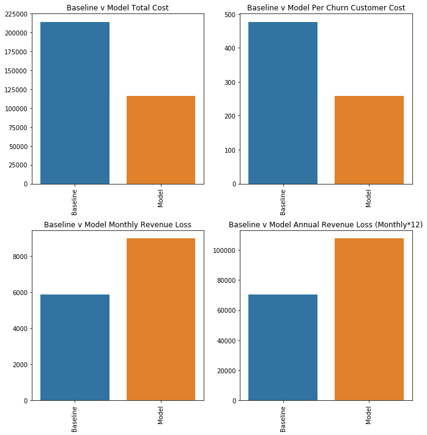

# Telco Customer Churn 

In the EDA we learned about the data, the different features within the data and we also completed feature engineering to gain more information about the data without as many independent variables. There was also a final unsupervised clustering model done to gain further insight on the characteristics to watch for.

Churn is a universal problem for companies both with internal staff and customers. 

In this notebook, the goal will be to optimize our prediction of customers that churn at telco.


```python
# import python libraries
import pandas as pd
import numpy as np
pd.set_option('display.max_columns',50)

#visualization libraries
import matplotlib.pyplot as plt
import seaborn as sns
%matplotlib inline


#preprocessing data
from sklearn.model_selection import train_test_split
from imblearn.over_sampling import SMOTE
from sklearn.preprocessing import StandardScaler

#models
from lightgbm import LGBMClassifier
import xgboost as xgb
from xgboost import XGBClassifier
from sklearn.ensemble import RandomForestClassifier,AdaBoostClassifier
from sklearn.linear_model import LogisticRegression
from sklearn.svm import SVC
from sklearn.tree import DecisionTreeClassifier

#evaluation metrics
from sklearn.metrics import precision_score, recall_score,f1_score, accuracy_score, roc_auc_score,\
classification_report,auc, roc_curve, confusion_matrix, zero_one_loss

#optimizing models
from sklearn.model_selection import RandomizedSearchCV

 

#pickle to save models
import pickle as pkl

#import tqdm
from tqdm import tqdm


#warnings
import warnings
warnings.filterwarnings('ignore')
```


```python
#random state
randstate = 89
```


```python
df = pd.read_csv('finmod.csv')
```


```python
print(df.shape)
df.head()
```

    (7043, 23)


<div>
<style scoped>
    .dataframe tbody tr th:only-of-type {
        vertical-align: middle;
    }

    .dataframe tbody tr th {
        vertical-align: top;
    }

    .dataframe thead th {
        text-align: right;
    }
</style>
<table border="1" class="dataframe">
  <thead>
    <tr style="text-align: right;">
      <th></th>
      <th>SeniorCitizen</th>
      <th>Dependents</th>
      <th>tenure</th>
      <th>PhoneService</th>
      <th>InternetService</th>
      <th>OnlineSecurity</th>
      <th>OnlineBackup</th>
      <th>DeviceProtection</th>
      <th>TechSupport</th>
      <th>StreamingTV</th>
      <th>StreamingMovies</th>
      <th>PaperlessBilling</th>
      <th>PaymentMethod</th>
      <th>MonthlyCharges</th>
      <th>TotalCharges</th>
      <th>Churn</th>
      <th>customerengage</th>
      <th>youngfam</th>
      <th>paperelect</th>
      <th>fiberint</th>
      <th>noprotection</th>
      <th>TotalServices</th>
      <th>customervalue</th>
    </tr>
  </thead>
  <tbody>
    <tr>
      <th>0</th>
      <td>0</td>
      <td>No</td>
      <td>1</td>
      <td>No</td>
      <td>DSL</td>
      <td>No</td>
      <td>Yes</td>
      <td>No</td>
      <td>No</td>
      <td>No</td>
      <td>No</td>
      <td>Yes</td>
      <td>Electronic check</td>
      <td>29.85</td>
      <td>29.85</td>
      <td>No</td>
      <td>0</td>
      <td>0</td>
      <td>1</td>
      <td>0</td>
      <td>0</td>
      <td>1</td>
      <td>-1</td>
    </tr>
    <tr>
      <th>1</th>
      <td>0</td>
      <td>No</td>
      <td>34</td>
      <td>Yes</td>
      <td>DSL</td>
      <td>Yes</td>
      <td>No</td>
      <td>Yes</td>
      <td>No</td>
      <td>No</td>
      <td>No</td>
      <td>No</td>
      <td>Mailed check</td>
      <td>56.95</td>
      <td>1889.50</td>
      <td>No</td>
      <td>1</td>
      <td>0</td>
      <td>0</td>
      <td>0</td>
      <td>0</td>
      <td>3</td>
      <td>1</td>
    </tr>
    <tr>
      <th>2</th>
      <td>0</td>
      <td>No</td>
      <td>2</td>
      <td>Yes</td>
      <td>DSL</td>
      <td>Yes</td>
      <td>Yes</td>
      <td>No</td>
      <td>No</td>
      <td>No</td>
      <td>No</td>
      <td>Yes</td>
      <td>Mailed check</td>
      <td>53.85</td>
      <td>108.15</td>
      <td>Yes</td>
      <td>0</td>
      <td>0</td>
      <td>0</td>
      <td>0</td>
      <td>0</td>
      <td>3</td>
      <td>0</td>
    </tr>
    <tr>
      <th>3</th>
      <td>0</td>
      <td>No</td>
      <td>45</td>
      <td>No</td>
      <td>DSL</td>
      <td>Yes</td>
      <td>No</td>
      <td>Yes</td>
      <td>Yes</td>
      <td>No</td>
      <td>No</td>
      <td>No</td>
      <td>Bank transfer (automatic)</td>
      <td>42.30</td>
      <td>1840.75</td>
      <td>No</td>
      <td>1</td>
      <td>0</td>
      <td>0</td>
      <td>0</td>
      <td>0</td>
      <td>3</td>
      <td>1</td>
    </tr>
    <tr>
      <th>4</th>
      <td>0</td>
      <td>No</td>
      <td>2</td>
      <td>Yes</td>
      <td>Fiber optic</td>
      <td>No</td>
      <td>No</td>
      <td>No</td>
      <td>No</td>
      <td>No</td>
      <td>No</td>
      <td>Yes</td>
      <td>Electronic check</td>
      <td>70.70</td>
      <td>151.65</td>
      <td>Yes</td>
      <td>0</td>
      <td>0</td>
      <td>1</td>
      <td>1</td>
      <td>1</td>
      <td>1</td>
      <td>-3</td>
    </tr>
  </tbody>
</table>
</div>


```python
# just like in EDA, turn boolean values into 1,0
#create a boolean list
BOOLEAN = list(df.columns[df.nunique() <= 2])
#use lambda functionality in pandas to replace all Yes/No to 1/0 in one pythonic string
df[BOOLEAN] = df[BOOLEAN].apply( lambda x: x.replace('Yes',1).replace('No',0))
```


```python
df.head()
```


<div>
<style scoped>
    .dataframe tbody tr th:only-of-type {
        vertical-align: middle;
    }

    .dataframe tbody tr th {
        vertical-align: top;
    }

    .dataframe thead th {
        text-align: right;
    }
</style>
<table border="1" class="dataframe">
  <thead>
    <tr style="text-align: right;">
      <th></th>
      <th>SeniorCitizen</th>
      <th>Dependents</th>
      <th>tenure</th>
      <th>PhoneService</th>
      <th>InternetService</th>
      <th>OnlineSecurity</th>
      <th>OnlineBackup</th>
      <th>DeviceProtection</th>
      <th>TechSupport</th>
      <th>StreamingTV</th>
      <th>StreamingMovies</th>
      <th>PaperlessBilling</th>
      <th>PaymentMethod</th>
      <th>MonthlyCharges</th>
      <th>TotalCharges</th>
      <th>Churn</th>
      <th>customerengage</th>
      <th>youngfam</th>
      <th>paperelect</th>
      <th>fiberint</th>
      <th>noprotection</th>
      <th>TotalServices</th>
      <th>customervalue</th>
    </tr>
  </thead>
  <tbody>
    <tr>
      <th>0</th>
      <td>0</td>
      <td>0</td>
      <td>1</td>
      <td>0</td>
      <td>DSL</td>
      <td>No</td>
      <td>Yes</td>
      <td>No</td>
      <td>No</td>
      <td>No</td>
      <td>No</td>
      <td>1</td>
      <td>Electronic check</td>
      <td>29.85</td>
      <td>29.85</td>
      <td>0</td>
      <td>0</td>
      <td>0</td>
      <td>1</td>
      <td>0</td>
      <td>0</td>
      <td>1</td>
      <td>-1</td>
    </tr>
    <tr>
      <th>1</th>
      <td>0</td>
      <td>0</td>
      <td>34</td>
      <td>1</td>
      <td>DSL</td>
      <td>Yes</td>
      <td>No</td>
      <td>Yes</td>
      <td>No</td>
      <td>No</td>
      <td>No</td>
      <td>0</td>
      <td>Mailed check</td>
      <td>56.95</td>
      <td>1889.50</td>
      <td>0</td>
      <td>1</td>
      <td>0</td>
      <td>0</td>
      <td>0</td>
      <td>0</td>
      <td>3</td>
      <td>1</td>
    </tr>
    <tr>
      <th>2</th>
      <td>0</td>
      <td>0</td>
      <td>2</td>
      <td>1</td>
      <td>DSL</td>
      <td>Yes</td>
      <td>Yes</td>
      <td>No</td>
      <td>No</td>
      <td>No</td>
      <td>No</td>
      <td>1</td>
      <td>Mailed check</td>
      <td>53.85</td>
      <td>108.15</td>
      <td>1</td>
      <td>0</td>
      <td>0</td>
      <td>0</td>
      <td>0</td>
      <td>0</td>
      <td>3</td>
      <td>0</td>
    </tr>
    <tr>
      <th>3</th>
      <td>0</td>
      <td>0</td>
      <td>45</td>
      <td>0</td>
      <td>DSL</td>
      <td>Yes</td>
      <td>No</td>
      <td>Yes</td>
      <td>Yes</td>
      <td>No</td>
      <td>No</td>
      <td>0</td>
      <td>Bank transfer (automatic)</td>
      <td>42.30</td>
      <td>1840.75</td>
      <td>0</td>
      <td>1</td>
      <td>0</td>
      <td>0</td>
      <td>0</td>
      <td>0</td>
      <td>3</td>
      <td>1</td>
    </tr>
    <tr>
      <th>4</th>
      <td>0</td>
      <td>0</td>
      <td>2</td>
      <td>1</td>
      <td>Fiber optic</td>
      <td>No</td>
      <td>No</td>
      <td>No</td>
      <td>No</td>
      <td>No</td>
      <td>No</td>
      <td>1</td>
      <td>Electronic check</td>
      <td>70.70</td>
      <td>151.65</td>
      <td>1</td>
      <td>0</td>
      <td>0</td>
      <td>1</td>
      <td>1</td>
      <td>1</td>
      <td>1</td>
      <td>-3</td>
    </tr>
  </tbody>
</table>
</div>


```python
# drop internet servie and total charges bc their values can be obtained within the other features
df = df.drop(columns=['InternetService','TotalCharges','PhoneService'])

# dummy variable
df = pd.get_dummies(df)
```


```python
#def X,y
y = df['Churn']
X = df.drop(columns = ['Churn'])
```


```python
# Churn/attrition rate
print(np.round(y.value_counts()[1]/(y.value_counts()[1]+y.value_counts()[0])*100,0),'% customer attrition rate')
```

    27.0 % customer attrition rate


##### Setting up the problem to solve:

Of the 7043 customers Telco has, there is a 27% customer attrition rate in the last month. I would consider this to be a very high, there should definitely be action taken to reduce this.

______

###### Notes

1. This is an imbalanced classificaton problem because we are trying to predict the under sampled class of customers in the data. In this case, the 27% of customers who have decided to leave Telco.


###### Real-world evaluation:

In this notebook I will evaluate various classification methods to come to a consensus decision on a final classifier that is able to optimize my ability to predict customer churn.

Forbes says that the cost of acquiring customers is 5x higher than retention. Using this as an assumption I will outline our business case below. 

The following assumptions were made about costs:

**Customer Churn**  

The cost of acquiring a new customer: \\$500 - Alot of investment goes into acquiring new customers such as marketing expenses, increase in ad revenue etc.

The cost of retaining an existing customer: \\$100 - provide a discount on service, sometimes providing better services for the same price or bundling services to offer a better value to the customer.

#### Baseline:
To establish a baseline that we want to compare to, this is what we will evaluate, and the assumptions we will make. 

**Baseline Cost**: We will assume that the baseline retention cost will be Telco spending \\$100 toward all the customers, and because it is not a targeted retention plan - they will still lose 20\% of customers that were to churn. What this means is that the Models baseline will be establiashed as it's Total Retention Cost (\\$100\*All Customers) + (\\$500\* churn customers\*0.20) / churn customers. This is what they end up spending per customer that would have churned.

For the model, we will assume that every dollar spent toward churn customers will save 100\% of the customers. However, for any that are not predicted - those will be the lost customers.


**Revenue**: We want to also know what the baseline revenue loss should be. To keep it simple, I took the the average MonthlyCharges of all the customers, and multiplied that by the 20\% of churn that we decided would still leave in the baseline. This will be considered the revenue lost to churn in the baseline model. 

For the model, we will take the actual revenue loss of those customers that were not predicted to churn. 


**Final**: The final evaluation will be to see if the total revenue loss and the total cost (not per churn customer) is higher in the model or the baseline.

### Model Evaluation

Now that we know the problem and what we need to solve, reduce the churn rate, and the method to evaluate each models performance in monetary costs; an explanation of the statistical metrics of evaluation.

##### Understanding the Model and metrics of evaluating success:

The model typically used for this type of problem is called a Classification Model. Classification models use features, like the ones we saw in the EDA to predict a target or dependent variable. In this case our target is the customer churn and the features are the ones we chose and created in the EDA. 

This classification model is has a binary target or a bernoulli distribution, where there are only 2 cases. Either a 0 if the customer does not churn and a 1 if they do. When we create the model, we will have to evaluate the success of it's predictions. 

In binary classification models we can visualize the confusion matrix, which looks like this:


To understand this, here are what each one means:

1. True Positive (TP): Actual Class is a Yes, Prediction is a Yes. 
2. True Negative (TN): Actual Class is a No, Prediction is a No. 
3. False Positive(FP): Actual Class is a No, Prediction is a Yes. 
4. False Negative(FN): Actual Class is a Yes, Prediction is a No. 

**Note**: Moving forward when you see 'positive class' or 'negative class' we are talking about the Yes/No or the 1/0 class. 

When evaluating our models we will be using the following metrics: 
Accuracy, Precision, Recall, ROC and AUC.

1. Accuracy - The most intuitive of all the metrics, it is simply the ratio of all the correctly predicted values to the total values. The calculation of accuracy would look like: TP + TN / (TP + TN + FP + FN). The accuracy is usually a good way to know how good the model is when there are balanced classes. In our case, the accuracy score is simply not enough to know how good the model is because we have imbalanced classes. 


2. Precision - is the ratio of all the correctly predicted positive predictions to the total predicted positive predictions. The calculation for precision looks like: TP / (TP + FP). Precision would answer the following, of all customers the model predicts to churn, how many actually churn? A high precision relates to the FP, meaning if the model doesn't actually have many FP predictions the precision can be very high. In an imabalanced data set like this one, a precision score could be misleading because the model may not make as many positive predicitions and thus not have many false positives. 


3. Recall (Sensitivity) - is the ratio of all the correctly predicted positive predictions to all the observations in the positive class. The calcuation is: TP / (TP + FN). What this would answer is, of all the customers that churn, how many did we actually predict correctly? A high recall rate would mean that the model does not miss predicting the customers that actually churned. 

In imbalanced cases, where the positive class that we want to predict, is also the minority in the model, we need to decide what is more important and how incorrect predictions can affect the actual problem we are trying to solve. For example, in our case, we have now assigned a cost to retention and acquisition so we can evaluate the cost of making false predictions.


##### FP or FN, which is more costly?
In our case we can evaluate just these two prediction errors and then we will know which of the evaluation metrics is most important to us.

The cost of a FP prediction: A False Positive prediction means that the model predicted the customer will churn, but they do not. The cost associated with this would be \\$100 per customer - assuming Telco uses the models predictions as the method of deciding who to spend money on for retention.

The cost of a FN prediction: A False Negative prediction means that we predicted the customer would not churn, and since no retention actions are taken, they actually do. This means that we have to acquire a new customer to replace them at a cost of \\$500 per customer.

Clearly, the goal should be to reduce the FN predictions. Which also means that maximizing the models recall score is what we want. We have to also be careful not to over predict the positive class and end up spending more on retention than our dummy model that we visualized earlier. 

Finally, in my opinion, the most important evaluation of a classification model is the Receiver Operating Characteristics (ROC) curve and the Area Under the Curve (AUC) score. 

What these two metrics aim to do is to provide a performance measurement for the model at various thresholds. The ROC curve is a probability curve, while the AUC represents the degree of 'correctness' (simple explanation). The curve is plotted with the (y)TPR (true positive rate) against the (x)FPR (false positive rate) . The AUC score, which is between 0-1 tells us how well the model is able to correctly identify 1's as 1's and 0's as 0's.

TPR is exactly the same as the Recall, and usually in the context of ROC, it is called Sensitivity. 

FPR is calculated using another metric called Specificity. Specificity is calculated like this: TN / (TN + FP), this is inversely related to recall. FPR is calculated like this: 1 - Specificity, which is the same as FP / (TN + FP).


---------- 


Now that the metrics for evaluating the models are explained and a benchmark has been set, let's decide on which model type we use.

There are 7043 total customers and 36 features in the model data. This includes all the dummy variables created.
Before starting any model it is always best to perform preprocessing and removing features that do not help in predicting the positive class (in this case).


```python
#correlations of the features
corr = X.corr()

#columns
CORRCOLS = corr.columns.tolist()
```


```python
#Threshold for removing correlated variables
threshold = 0.85

# Absolute value correlation matrix
corr_matrix = corr.abs()
corr_matrix.head()

# lower triangle of correlations - same as the correlation matrix above
lower = corr_matrix.where(np.tril(np.ones(corr_matrix.shape), k=-1).astype(np.bool))
lower


# Select columns with correlations above threshold
to_drop = [column for column in lower.columns if any(lower[column] >= threshold)]

X = X.drop(columns = to_drop)
print('There are %d columns to remove :' % (len(to_drop)))
to_drop
```

    There are 6 columns to remove :


    ['Dependents',
     'OnlineSecurity_No internet service',
     'OnlineBackup_No internet service',
     'DeviceProtection_No internet service',
     'TechSupport_No internet service',
     'StreamingTV_No internet service']


```python
#set list of final columns as features
features = X.columns.tolist()
```


```python
# time to split up the data into a training and testing set
X_split, X_test, y_split, y_test = train_test_split(X,y,test_size=0.2,random_state=randstate,stratify=y)
# split the data once more - avoids any data leakage between training and testing data

X_train, X_val, y_train, y_val = train_test_split(X_split,y_split, 
                                                  test_size=0.3, stratify=y_split, random_state=randstate)
```

The model we create should be able to beat the cost per customer we have in the baseline. 


```python
print('training data size:', X_train.shape)
print('validation data size:', X_val.shape)
print('Test data size:', X_test.shape)
```

    training data size: (3943, 28)
    validation data size: (1691, 28)
    Test data size: (1409, 28)


```python
# ROC_AUC curve for evaluation of True/False positives to see how well the actual predictions did v the true results

#show scores and return fpr,tpr 
def evaluate_model(X,y,model,name):
    # predicted results and probabilties
    y_pred = model.predict(X)
    y_prob = model.predict_proba(X)

    #get my accuracy, precision and recall scores
    accuracy = accuracy_score(y, y_pred)
    precision = precision_score(y, y_pred)
    recall = recall_score(y,y_pred)
    
    #print the scores
    print(f'\n\nScoring Metrics of {name} model')
    print(f'Accuracy Score :  {accuracy}')
    print(f'Precision Score : {precision}')
    print(f'Recall Score :    {recall}')


    #calculating my false_positive_rate and true_positive_rate using the probabilities of the positive label
    fpr, tpr, thresh = roc_curve(y, y_prob[:,1])
    roc_auc = auc(fpr,tpr)
    
    return fpr,tpr
```

To decide which modelling algorithm I will chose, I decided to instantiate and fit the training data on 6 different model types and evaluate their Accuracy, Precision, Recall scores as well as the ROC AUC curve. I will also see the time it takes for the model to be fit just to evaluate efficiencies of the models. 


The 6 models I chose to evaluate for this classification problem are: 

1. Logistic Regression
2. Random Forests
3. Light-Gradient Boost Model
4. XGBoost
5. AdaBoost
6. Support Vector Machine (SVC)


```python
#logistic regression
logit = LogisticRegression(random_state=randstate)
```


```python
%%timeit
logit.fit(X_train,y_train)
```

    20.1 ms ± 333 µs per loop (mean ± std. dev. of 7 runs, 10 loops each)


```python
# random forests
rfm = RandomForestClassifier(random_state=randstate)
```


```python
%%timeit
rfm.fit(X_train,y_train)
```

    34.3 ms ± 1.64 ms per loop (mean ± std. dev. of 7 runs, 10 loops each)


```python
# light-gradient boost model
lgboost = LGBMClassifier(random_state=randstate)
```


```python
%%timeit
lgboost.fit(X_train,y_train)
```

    156 ms ± 66.1 ms per loop (mean ± std. dev. of 7 runs, 1 loop each)


```python
# xgboost
xgbm = XGBClassifier(random_state=randstate)
```


```python
%%timeit
xgbm.fit(X_train,y_train)
```

    707 ms ± 94.4 ms per loop (mean ± std. dev. of 7 runs, 1 loop each)


```python

#AdaBoost
ada = AdaBoostClassifier(random_state=randstate)
```


```python
%%timeit
ada.fit(X_train,y_train)
```

    130 ms ± 920 µs per loop (mean ± std. dev. of 7 runs, 10 loops each)


```python
#Support Vector Machine
svcm = SVC(probability=True,random_state=randstate)
```


```python
%%timeit
svcm.fit(X_train,y_train)
```

    3.08 s ± 9.32 ms per loop (mean ± std. dev. of 7 runs, 1 loop each)


Based on the above, The SVC is by far the slowest model and I am unlikely to choose it unless it outperforms the rest by a significant margin.


```python
#evaluation of all the models on the validation set 
logfpr, logtpr = evaluate_model(X_val,y_val,logit,'logistic regression')
rfpr, rtpr = evaluate_model(X_val,y_val,rfm,'random forests')
lgbfpr, lgbtpr = evaluate_model(X_val,y_val,lgboost,'light gradient boost')
xfpr,xtpr = evaluate_model(X_val,y_val,xgbm,'xgboost')
adfpr,adtpr = evaluate_model(X_val,y_val,ada,'adaboost')
svfpr,svtpr = evaluate_model(X_val,y_val,svcm,'svc')
```

    
    
    Scoring Metrics of logistic regression model
    Accuracy Score :  0.8054405677114134
    Precision Score : 0.6612903225806451
    Recall Score :    0.5478841870824054
    
    
    Scoring Metrics of random forests model
    Accuracy Score :  0.7811945594322885
    Precision Score : 0.6193353474320241
    Recall Score :    0.45657015590200445
    
    
    Scoring Metrics of light gradient boost model
    Accuracy Score :  0.7930218805440568
    Precision Score : 0.6363636363636364
    Recall Score :    0.5144766146993318
    
    
    Scoring Metrics of xgboost model
    Accuracy Score :  0.7989355410999409
    Precision Score : 0.6518105849582173
    Recall Score :    0.5211581291759465
    
    
    Scoring Metrics of adaboost model
    Accuracy Score :  0.7912477823772915
    Precision Score : 0.638728323699422
    Recall Score :    0.4922048997772829
    
    
    Scoring Metrics of svc model
    Accuracy Score :  0.7989355410999409
    Precision Score : 0.6607669616519174
    Recall Score :    0.49888641425389757


Looking at the 3 metrics, and the time it takes to run the three models - I believe the one model that will definitely not make it past this point is the SVC. Let's see what the ROC curve and AUC scores are.


```python
#rocauc for all models
def plot_rocauc():
    fig = plt.figure(figsize=(10,10))
    plt.plot(logfpr, logtpr,label = f'Logistic AUC: {auc(logfpr,logtpr)}')
    plt.plot(rfpr, rtpr,label = f'Random Forests AUC: {auc(rfpr,rtpr)}')
    plt.plot(lgbfpr, lgbtpr,label = f'LGBM AUC: {auc(lgbfpr,lgbtpr)}')
    plt.plot(xfpr, xtpr,label = f'XGBoost AUC: {auc(xfpr,xtpr)}')
    plt.plot(adfpr, adtpr,label = f'AdaBoost AUC: {auc(adfpr,adtpr)}')
    plt.plot(svfpr, svtpr,label = f'SVC AUC: {auc(svfpr,svtpr)}')
    

    plt.plot([0, 1], [0, 1], 'r--') #plotting a line across for relativity to see how well the model does
    plt.legend()
    
    plt.title('ROC Curve for 4 Models')
    plt.ylabel('True Positive Rate')
    plt.xlabel('False Positive Rate')
    
    plt.show()
```


```python
plot_rocauc()
```


The SVC model and RF model are the two lowest AUC scores. Keeping in mind that alot of the models can have parameter tuning done, I will only drop the SVC. I am going to start with a Logistic model first.

 ----------------


-----------

The training data is larger than both the validation and test data. The reson for this is to ensure the model has as many unique observations to train on so that it can create a generalized model that is able to identify as correctly as many of the customers in our data as possible. 

Finally, we want to ensure we do not overfit our model to the training data. The reason for splitting our data earlier 2 times was because we want to ensure there is no leakage between the test data. In a real world example, we likely do not have the opportunity to 'test', we would likely only have a validation set.

In a business case like this one, Telco us this data as a way to train their model and then after 1 year of using the model to predict churn, it would be evaluated against what ended up actually happening and if they were able to reduce their churn rate.


```python
#scale all data - tr, val, test. Scaling makes sure the numeric data all have similar distributions to not let 
#the model think a value like Total Charges is more important because it is very high.
#create copies of the original, use original later for eval

X_scaleTR = X_train.copy()
X_scaleV = X_val.copy()
X_scaleTE = X_test.copy()
scaler = StandardScaler()
scaler.fit(X_train)
X_scaleTR[features] = scaler.transform(X_train[features])
X_scaleV[features] = scaler.transform(X_val[features])
X_scaleTE[features] = scaler.transform(X_test[features])
```

---------


```python
# ROC_AUC curve for evaluation of True/False positives to see how well the actual predictions did v the true results

#use this to evaluate each models predictions
def create_ROC_AUC(X,y,model,name):
    # predicted results and probabilties
    y_pred = model.predict(X)
    y_prob = model.predict_proba(X)

    #get my accuracy, precision and recall scores
    accuracy = accuracy_score(y, y_pred)
    precision = precision_score(y, y_pred)
    recall = recall_score(y,y_pred)
    
    print(f'{name} Model Evaluation')
    #print the scores
    print(f'Accuracy Score :  {accuracy}')
    print(f'Precision Score : {precision}')
    print(f'Recall Score :    {recall}\n')


    #calculating my false_positive_rate and true_positive_rate using the probabilities of the positive label
    fpr, tpr, thresh = roc_curve(y, y_prob[:,1])
    roc_auc = auc(fpr,tpr)

    #plotting the ROC curve
    fig = plt.figure()
    plt.plot(fpr, tpr,label = f'AUC SCORE: {roc_auc}') #show my AUC score
    plt.plot([0, 1], [0, 1], 'r--') #plotting a line across for relativity to see how well the model does
    plt.legend()

    plt.title('ROC Curve')
    plt.ylabel('True Positive Rate')
    plt.xlabel('False Positive Rate')

    plt.show()
    print(classification_report(y,y_pred))
    tn, fp, fn, tp = confusion_matrix(y, y_pred).ravel()
    print(f'True Positive: {tp} \nTrue Negative: {tn} \nFalse Positive: {fp} \nFalse Negative: {fn}')
    
    return tn,fp,fn,tp
    
```


```python
#to evaluate whether the model does better than the baseline 
def model_baseline(X,y,tp,fp,fn,y_pred):
    
    X_ = X.copy()
    X_['churn'] = y
    X_['pred'] = y_pred
    X_['diff'] = X_['churn'] - X_['pred']
    missed_charges = X_.loc[X_['diff'] == 1]['MonthlyCharges']
    
    
    #actual churn in test
    actual_churn = y.value_counts()[1]
    
    #model values
    model_churn = tp+fp
    model_retention = 100*model_churn
    model_acquisition = 500*(fn)
    #modelcosts
    model_cost = (model_retention+model_acquisition)
    model_percust = model_cost/actual_churn
    
    #cost to overpredictions
    ov_p = round((model_churn-actual_churn)*0.20,0)
    #model revloss
    model_mrevloss = round(missed_charges.mean() * (fn+ov_p),2)
    model_trevloss = model_mrevloss*12
    
    #baseline values
    churn_cust = round(actual_churn * 0.20,0)
    baseline_acquisition = 500 * churn_cust
    baseline_retention = 100 * X_.shape[0]
    #baseline costs
    baseline_cost = (baseline_acquisition + baseline_retention)
    baseline_percust = round(baseline_cost/actual_churn,2)
    
    #baseline revloss (annual)
    baseline_charges = X_['MonthlyCharges'].mean()
    baseline_mrevloss = round(baseline_charges*churn_cust,2)
    baseline_trevloss = baseline_mrevloss*12
    

    #final totals
    model_final = model_trevloss + model_cost
    baseline_final = baseline_trevloss + baseline_cost
    difference_ = round(baseline_final - model_final,2)
    percust_diff = round(baseline_percust-model_percust,2)
    
    #create subplots
    plt.figure(figsize=(10,10))
    #total
    plt.subplot(2,2,1)
    plt.title('Baseline v Model Total Cost')
    sns.barplot(x=['Baseline','Model'], y=[baseline_cost,model_cost])
    plt.xticks(rotation=90)
    
    #per
    plt.subplot(2,2,2)
    plt.title('Baseline v Model Per Churn Customer Cost')
    sns.barplot(x=['Baseline','Model'], y=[baseline_percust,model_percust])
    plt.xticks(rotation=90)
    
    #monthly
    plt.subplot(2,2,3)
    plt.title('Baseline v Model Monthly Revenue Loss')
    sns.barplot(x=['Baseline','Model'], y=[baseline_mrevloss,model_mrevloss])
    plt.xticks(rotation=90)
    
    #Total
    plt.subplot(2,2,4)
    plt.title('Baseline v Model Annual Revenue Loss (Monthly*12)')
    sns.barplot(x=['Baseline','Model'], y=[baseline_trevloss,model_trevloss])
    plt.xticks(rotation=90)
    
    plt.tight_layout()
    plt.show()
    
    plt.figure(figsize=(5,5))
    plt.title('Final Evaluation')
    sns.barplot(x=['Baseline Total','Model Total'], y=[baseline_final,model_final])
    plt.xticks(rotation=90)
    plt.show()
    
    print(f'Baseline Cost per Churn Customer: {baseline_percust}')
    print(f'Model Cost per Churn Customer: {model_percust}')
    print(f'Cost Savings per Churn Customer: {baseline_percust-model_percust}\n\n')
    
    print(f'Basline Cost and Revenue Loss: ${baseline_final}')
    print(f'Model Cost and Revenue Loss: ${model_final}')
    print(f'Total Savings With Model: ${difference_}')
    
    return baseline_final, model_final, difference_,percust_diff
```

# Logistic Regression Model

Logistic regression is a statistical method for analyzing a dataset in which there are one or more independent variables that determine an outcome. The outcome is measured with a dichotomous variable (in which there are only two possible outcomes).

In logistic regression, the dependent variable is binary or dichotomous, i.e. it only contains data coded as 1 (TRUE, success, churn, etc.) or 0 (FALSE, failure, non-churn, etc.).

The goal of logistic regression is to find the best fitting (yet  reasonable) model to describe the relationship between the dichotomous characteristic of interest (dependent variable = response or outcome variable) and a set of independent (predictor or explanatory) variables. Logistic regression generates the coefficients (and its standard errors and significance levels) of a formula to predict a logit transformation of the probability of presence of the characteristic of interest:


###### The baseline score of the model without optimization:

Scoring Metrics of logistic regression model
1. Accuracy Score :  0.8054405677114134
2. Precision Score : 0.6612903225806451
3. Recall Score :    0.5478841870824054


```python
cost = [x for x in np.linspace(0.0001,1,50,endpoint=True)]

#parameters
param_grid = {
    'C': cost,
    'penalty': ['l1','l2'],
    'class_weight': ['balanced']
}

#create instance of logistic model
logit = LogisticRegression(random_state=randstate)

#create randomsearch
rand_log = RandomizedSearchCV(estimator=logit,param_distributions=param_grid,n_iter=100,
                              cv=3,random_state=randstate,verbose=1,return_train_score=False)

rand_log.fit(X_scaleTR,y_train)
optimal_log = rand_log.best_params_
```

    Fitting 3 folds for each of 100 candidates, totalling 300 fits


    [Parallel(n_jobs=1)]: Using backend SequentialBackend with 1 concurrent workers.
    [Parallel(n_jobs=1)]: Done 300 out of 300 | elapsed:    7.2s finished


```python
#use optimal params to fit a new logistic model
opt_log = LogisticRegression(**optimal_log)
```


```python
opt_log.fit(X_scaleTR,y_train)
```


    LogisticRegression(C=0.2449734693877551, class_weight='balanced', dual=False,
              fit_intercept=True, intercept_scaling=1, max_iter=100,
              multi_class='warn', n_jobs=None, penalty='l2', random_state=None,
              solver='warn', tol=0.0001, verbose=0, warm_start=False)


```python
tn,fp,fn,tp = create_ROC_AUC(X_scaleV,y_val,opt_log,'Logistic')
```

    Logistic Model Evaluation
    Accuracy Score :  0.7528089887640449
    Precision Score : 0.5235920852359208
    Recall Score :    0.7661469933184856
    


                  precision    recall  f1-score   support
    
               0       0.90      0.75      0.82      1242
               1       0.52      0.77      0.62       449
    
       micro avg       0.75      0.75      0.75      1691
       macro avg       0.71      0.76      0.72      1691
    weighted avg       0.80      0.75      0.76      1691
    
    True Positive: 344 
    True Negative: 929 
    False Positive: 313 
    False Negative: 105


Here is how the above is best understood. The optimized logistic model was able to correctly identify {{tp}} (TP) of the 523 (TP+FN) customers who have churned. Additionally, the model ended up over predicting the number of customers who would have churned by {{(tp+fp) - (tp+fn)}} because there were {{fp}} FP predictions. The cost of a FP is \\$100 because that would mean Telco targets these customers as a possibility to churn. While the FN have a cost of \\$500 because every customer that the model misses will churn and must now be replaced.

Having a high recall means we have lower FN but have a lot more FP. If our over predictions have a higher than 5:1 ratio, this becomes more costly to Telco than a FN predicition. 

Below is how well the model does compared to the baseline.


```python
y_logpred = opt_log.predict(X_scaleV)

bfinlog,mfinlog,difflog,pclog = model_baseline(X_val,y_val,tp,fp,fn,y_logpred)
```


    Baseline Cost per Churn Customer: 476.84
    Model Cost per Churn Customer: 263.25167037861917
    Cost Savings per Churn Customer: 213.5883296213808
    
    
    Basline Cost and Revenue Loss: $284669.12
    Model Cost and Revenue Loss: $224980.8
    Total Savings With Model: $59688.32


The cost savings per customer comes out to \\${{pclog}}, while the logistic model also gets a total savings including the non-lost revenue savings of \\${{difflog}}.

# Random Forests


##### The baseline scores for the random forest classifier:

Scoring Metrics of random forests model
1. Accuracy Score :  0.7811945594322885
2. Precision Score : 0.6193353474320241
3. Recall Score :    0.45657015590200445


```python
#set up search grid
#Number of search trees
n_estimators=[10,100,200,300,500,1000]
# Number of features to consider at every split
max_features = ['auto', 0.5,0.8,None]
# Maximum number of levels in tree
max_depth = [2,5,10,20,50]
# Minimum number of samples required to split a node
min_samples_split = [x for x in np.linspace(0.001,1,20,endpoint=True)]
# Minimum number of samples required at each leaf node
min_samples_leaf = [2,3,5,6]
# Method of selecting samples for training each tree
bootstrap = [True, False]
#criterion
criterion=['gini','entropy']
#create the random grid
random_grid = {'n_estimators':n_estimators,
              'max_features':max_features,
              'max_depth':max_depth,
              'min_samples_split':min_samples_split,
              'min_samples_leaf':min_samples_leaf,
              'bootstrap':bootstrap,
              'criterion':criterion}

#instance
rfmod = RandomForestClassifier(random_state=randstate)

#randomsearch
rand_rf = RandomizedSearchCV(estimator=rfmod,param_distributions=random_grid,n_iter=100,cv=3,verbose=2,
                            return_train_score=False,n_jobs=-1,random_state=randstate)


#fit the random search and get the optimal parameters
rand_rf.fit(X_scaleTR,y_train)
optimal_rf = rand_rf.best_params_

```

    Fitting 3 folds for each of 100 candidates, totalling 300 fits


    [Parallel(n_jobs=-1)]: Using backend LokyBackend with 4 concurrent workers.
    [Parallel(n_jobs=-1)]: Done 114 tasks      | elapsed:   37.8s
    [Parallel(n_jobs=-1)]: Done 236 tasks      | elapsed:  1.2min
    [Parallel(n_jobs=-1)]: Done 300 out of 300 | elapsed:  1.5min finished


```python

# create new instance with optimal parameters
rfmod = RandomForestClassifier(**optimal_rf,random_state=randstate)
rfmod.fit(X_scaleTR,y_train)

#create predictions
y_rfpred = rfmod.predict(X_scaleV)

# evaluate metrics
tn,fp,fn,tp = create_ROC_AUC(X_scaleV,y_val,rfmod,'RandomForest')
```

    RandomForest Model Evaluation
    Accuracy Score :  0.7256061502069782
    Precision Score : 0.4890829694323144
    Recall Score :    0.7483296213808464
    


                  precision    recall  f1-score   support
    
               0       0.89      0.72      0.79      1242
               1       0.49      0.75      0.59       449
    
       micro avg       0.73      0.73      0.73      1691
       macro avg       0.69      0.73      0.69      1691
    weighted avg       0.78      0.73      0.74      1691
    
    True Positive: 336 
    True Negative: 891 
    False Positive: 351 
    False Negative: 113


The random forest classifier was significantly improved by the random search. I think it may be worth trying to fit for the recall score.


```python
# REFIT FOR RECALL

#set up search grid
#Number of search trees
n_estimators=[10,100,200,300,500,1000]
# Number of features to consider at every split
max_features = ['auto', 0.5,0.8,None]
# Maximum number of levels in tree
max_depth = [2,5,10,20,50]
# Minimum number of samples required to split a node
min_samples_split = [x for x in np.linspace(0.001,1,20,endpoint=True)]
# Minimum number of samples required at each leaf node
min_samples_leaf = [2,3,5,6]
# Method of selecting samples for training each tree
bootstrap = [True, False]
#criterion
criterion=['gini','entropy']
#create the random grid
random_grid = {'n_estimators':n_estimators,
              'max_features':max_features,
              'max_depth':max_depth,
              'min_samples_split':min_samples_split,
              'min_samples_leaf':min_samples_leaf,
              'bootstrap':bootstrap,
              'criterion':criterion}

#instance
rfmod = RandomForestClassifier(random_state=randstate)

#randomsearch
rand_rf = RandomizedSearchCV(estimator=rfmod,param_distributions=random_grid,n_iter=100,cv=3,verbose=2,
                            return_train_score=False,n_jobs=-1,scoring='recall',refit='recall',
                            random_state=randstate)


#fit the random search and get the optimal parameters
rand_rf.fit(X_scaleTR,y_train)
optimal_rf = rand_rf.best_params_

```

    Fitting 3 folds for each of 100 candidates, totalling 300 fits


    [Parallel(n_jobs=-1)]: Using backend LokyBackend with 4 concurrent workers.
    [Parallel(n_jobs=-1)]: Done  33 tasks      | elapsed:   10.1s
    [Parallel(n_jobs=-1)]: Done 154 tasks      | elapsed:   55.0s
    [Parallel(n_jobs=-1)]: Done 300 out of 300 | elapsed:  1.6min finished


```python
# create new instance with optimal parameters
rfrecmod = RandomForestClassifier(**optimal_rf,random_state=randstate)
rfrecmod.fit(X_scaleTR,y_train)

#create predictions
y_rfpred = rfrecmod.predict(X_scaleV)

#score
tn,fp,fn,tp = create_ROC_AUC(X_scaleV,y_val,rfrecmod,'RandomForest')
```

    RandomForest Model Evaluation
    Accuracy Score :  0.7256061502069782
    Precision Score : 0.4890829694323144
    Recall Score :    0.7483296213808464
    


                  precision    recall  f1-score   support
    
               0       0.89      0.72      0.79      1242
               1       0.49      0.75      0.59       449
    
       micro avg       0.73      0.73      0.73      1691
       macro avg       0.69      0.73      0.69      1691
    weighted avg       0.78      0.73      0.74      1691
    
    True Positive: 336 
    True Negative: 891 
    False Positive: 351 
    False Negative: 113


```python
# compare to baseline
bfinrf,mfinrf,rfdiff,pcrf = model_baseline(X_val,y_val,tp,fp,fn,y_rfpred)
```


    Baseline Cost per Churn Customer: 476.84
    Model Cost per Churn Customer: 278.84187082405344
    Cost Savings per Churn Customer: 197.99812917594653
    
    
    Basline Cost and Revenue Loss: $284669.12
    Model Cost and Revenue Loss: $238882.84
    Total Savings With Model: $45786.28


# AdaBoost

AdaBoosting Classifier, or Adaptive Boosting Classifier is like it's name suggests adaptive in that it tries to minimize the error of incorrect predictions during training by fitting additional copies of the classifier on top of the base_estimator with adjusted weights to reduce error and then focus on the harder to predict ones until it can reach a minimal error. 

It's adaptive because it does not simply train once and output a prediction, it tries to learn from it's base estimator and changes it's weights. 

There are 3 hyper-parameters that we will try to optimize the model with.

base_estimator - the estimator to use as the base before boosting for optimization. The default here is a decision tree.

n_estimators - the number of estimators at which the boosting is terminated - how many weak classifiers.

learning_rate (0-1) - the learning rate shrinks the contribution of each classifier. There is a tradeoff between learning_rate and n_estimators.


###### The baseline scores of the model without optimization:

Scoring Metrics of adaboost model
1. Accuracy Score :  0.7912477823772915
2. Precision Score : 0.638728323699422
3. Recall Score :    0.4922048997772829


```python
#run this to see what are possible weak classifiers to use in AdaBoost boosting
import inspect
from sklearn.utils.testing import all_estimators
for name, clf in all_estimators(type_filter='classifier'):
    if 'sample_weight' in inspect.getargspec(clf().fit)[0]:
       print(name)
```

    AdaBoostClassifier
    BaggingClassifier
    BernoulliNB
    CalibratedClassifierCV
    ComplementNB
    DecisionTreeClassifier
    ExtraTreeClassifier
    ExtraTreesClassifier
    GaussianNB
    GradientBoostingClassifier
    LinearSVC
    LogisticRegression
    LogisticRegressionCV
    MultinomialNB
    NuSVC
    Perceptron
    RandomForestClassifier
    RidgeClassifier
    RidgeClassifierCV
    SGDClassifier
    SVC


```python
dt_stump = DecisionTreeClassifier(max_depth=1,min_samples_leaf=1)
rf_tree = RandomForestClassifier(max_depth=1,n_estimators=10)


# create parameter grid
lrate = [x for x in np.linspace(0.001,1,num=30, endpoint=True)]
estimators = np.arange(100,1000,25)
params = {'base_estimator': [dt_stump,rf_tree],
          'n_estimators': estimators,
          'learning_rate': lrate
          
}

#assign model instance
model = AdaBoostClassifier(random_state=randstate)

#create the randomsearch 
random_ada = RandomizedSearchCV(estimator=model,param_distributions=params,n_iter=100,n_jobs=-1,\
                               cv=3,verbose=5,random_state=randstate)

random_ada.fit(X_scaleTR,y_train)
```

    Fitting 3 folds for each of 100 candidates, totalling 300 fits


    [Parallel(n_jobs=-1)]: Using backend LokyBackend with 4 concurrent workers.
    [Parallel(n_jobs=-1)]: Done  10 tasks      | elapsed:   17.7s
    [Parallel(n_jobs=-1)]: Done  64 tasks      | elapsed:  2.6min
    [Parallel(n_jobs=-1)]: Done 154 tasks      | elapsed:  5.7min
    [Parallel(n_jobs=-1)]: Done 280 tasks      | elapsed: 12.8min
    [Parallel(n_jobs=-1)]: Done 300 out of 300 | elapsed: 14.2min finished


    RandomizedSearchCV(cv=3, error_score='raise-deprecating',
              estimator=AdaBoostClassifier(algorithm='SAMME.R', base_estimator=None,
              learning_rate=1.0, n_estimators=50, random_state=89),
              fit_params=None, iid='warn', n_iter=100, n_jobs=-1,
              param_distributions={'base_estimator': [DecisionTreeClassifier(class_weight=None, criterion='gini', max_depth=1,
                max_features=None, max_leaf_nodes=None,
                min_impurity_decrease=0.0, min_impurity_split=None,
                min_samples_leaf=1, min_samples_split=2,
                min_we...77586206896551, 0.8622068965517241, 0.8966551724137931, 0.9311034482758621, 0.965551724137931, 1.0]},
              pre_dispatch='2*n_jobs', random_state=89, refit=True,
              return_train_score='warn', scoring=None, verbose=5)


```python
optimal_ada = random_ada.best_params_
```


```python
#create an instance of the adaboost model with the optimal parameters from the random search
adamod = AdaBoostClassifier(**ada_optimal)
adamod.fit(X_scaleTR,y_train)
```


    AdaBoostClassifier(algorithm='SAMME.R',
              base_estimator=DecisionTreeClassifier(class_weight=None, criterion='gini', max_depth=1,
                max_features=None, max_leaf_nodes=None,
                min_impurity_decrease=0.0, min_impurity_split=None,
                min_samples_leaf=1, min_samples_split=2,
                min_weight_fraction_leaf=0.0, presort=False, random_state=None,
                splitter='best'),
              learning_rate=0.5831578947368421, n_estimators=250,
              random_state=None)


```python
tn,fp,fn,tp = create_ROC_AUC(X_scaleV,y_val,adamod,'AdaBoost')
```

    AdaBoost Model Evaluation
    Accuracy Score :  0.7965700768775872
    Precision Score : 0.6495726495726496
    Recall Score :    0.5077951002227171
    


                  precision    recall  f1-score   support
    
               0       0.84      0.90      0.87      1242
               1       0.65      0.51      0.57       449
    
       micro avg       0.80      0.80      0.80      1691
       macro avg       0.74      0.70      0.72      1691
    weighted avg       0.79      0.80      0.79      1691
    
    True Positive: 228 
    True Negative: 1119 
    False Positive: 123 
    False Negative: 221


The optimal parameters do not score much higher than the model without hyper parameter optimization. 

I will now rerun the randomized search refitting for recall.


```python
# REFIT FOR RECALL 
dt_stump = DecisionTreeClassifier(max_depth=1,min_samples_leaf=1)
rf_tree = RandomForestClassifier(max_depth=1,n_estimators=10)


# create parameter grid
lrate = [x for x in np.linspace(0.0001,1,num=30, endpoint=True)]
estimators = np.arange(50,250,25)
params = {'base_estimator': [dt_stump,rf_tree],
          'n_estimators': estimators,
          'learning_rate': lrate
          
}

#assign model instance
model = AdaBoostClassifier(random_state=randstate)

#create the randomsearch 
random_ada = RandomizedSearchCV(estimator=model,param_distributions=params,n_iter=100,n_jobs=-1,\
                               cv=3,verbose=5,random_state=randstate,scoring='recall',refit='recall',
                               return_train_score=False)

random_ada.fit(X_scaleTR,y_train)
optimal_ada = random_ada.best_params_
```

    Fitting 3 folds for each of 100 candidates, totalling 300 fits


    [Parallel(n_jobs=-1)]: Using backend LokyBackend with 4 concurrent workers.
    [Parallel(n_jobs=-1)]: Done  10 tasks      | elapsed:    4.3s
    [Parallel(n_jobs=-1)]: Done  64 tasks      | elapsed:   36.0s
    [Parallel(n_jobs=-1)]: Done 154 tasks      | elapsed:  1.6min
    [Parallel(n_jobs=-1)]: Done 280 tasks      | elapsed:  2.9min
    [Parallel(n_jobs=-1)]: Done 300 out of 300 | elapsed:  3.1min finished


```python
#create an instance of the adaboost model with the optimal parameters from the random search - RECALL
adarecmod = AdaBoostClassifier(**ada_optimal)
adarecmod.fit(X_scaleTR,y_train)
tn,fp,fn,tp = create_ROC_AUC(X_scaleV,y_val,adarecmod,'AdaBoost')
```

    AdaBoost Model Evaluation
    Accuracy Score :  0.7965700768775872
    Precision Score : 0.6495726495726496
    Recall Score :    0.5077951002227171
    


                  precision    recall  f1-score   support
    
               0       0.84      0.90      0.87      1242
               1       0.65      0.51      0.57       449
    
       micro avg       0.80      0.80      0.80      1691
       macro avg       0.74      0.70      0.72      1691
    weighted avg       0.79      0.80      0.79      1691
    
    True Positive: 228 
    True Negative: 1119 
    False Positive: 123 
    False Negative: 221


Even with the optimized parameters refit for recall, the model still does not do much better than the un-optimized version. 

Finally, I will look at what this means for the business case:


```python
y_adapred = adarecmod.predict(X_scaleV)
bfada,mfada,diffada,pcada = model_baseline(X_val,y_val,tp,fp,fn,y_adapred)
```


    Baseline Cost per Churn Customer: 476.84
    Model Cost per Churn Customer: 324.2761692650334
    Cost Savings per Churn Customer: 152.5638307349666
    
    
    Basline Cost and Revenue Loss: $284669.12
    Model Cost and Revenue Loss: $309919.36
    Total Savings With Model: $-25250.24


The AdaBoosting method was able to do well at savings per customer \\${{pcada}}, but the total savings is not as good as the Random Forest model \\${{diffada}}.

# Light Gradient Boost

Light GBM is a fast, distributed, high-performance gradient boosting framework based on decision tree algorithm, used for ranking, classification and many other machine learning tasks.

Since it is based on decision tree algorithms, it splits the tree leaf wise with the best fit whereas other boosting algorithms split the tree depth wise or level wise rather than leaf-wise. So when growing on the same leaf in Light GBM, the leaf-wise algorithm can reduce more loss than the level-wise algorithm and hence results in much better accuracy which can rarely be achieved by any of the existing boosting algorithms. Also, it is surprisingly very fast, hence the word ‘Light’.

The hyper parameters we will tune are:


1. num_leaves : number of leaves in one tree 
2. max_depth: Specify the max depth to which tree will grow. This parameter is used to deal with overfitting.
3. min_data_in_leaf: Min number of data in one leaf.

There are actually alot more, like the learning rate and a few other parameters that can be used during fitting.

With LGBM, we will use the optimal results from the randomsearch to then create a better model using the fit parameters on the LGBM classifier.


#### The baseline scores for the LGBM model are:

Scoring Metrics of light gradient boost model
1. Accuracy Score :  0.7930218805440568
2. Precision Score : 0.6363636363636364
3. Recall Score :    0.5144766146993318


```python
#parameters
lrate = [x for x in np.linspace(0.001,0.1,10,endpoint=True)]
leaves = [100,300,900,1200,2000,5000]
depth = [5,10,25,30]
data_leaf = [5,10,11,12,13,14,15,20]

#parameter grid
param_grid = {
    'learning_rate': lrate,
    'num_leaves': leaves,
    'max_depth': depth,
    'min_data_in_leaf': data_leaf,
    'class_weight': ['balanced']
}

#model instance
lgb_mod = LGBMClassifier(random_state=randstate,silent=True)

#randomcv
rand_lgb = RandomizedSearchCV(estimator=lgb_mod, param_distributions= param_grid,\
                              n_iter=100,random_state=randstate,cv=3,verbose=1,n_jobs=-1,
                             return_train_score=False)

rand_lgb.fit(X_scaleTR,y_train)
optimal_lgb = rand_lgb.best_params_
```

    Fitting 3 folds for each of 100 candidates, totalling 300 fits


    [Parallel(n_jobs=-1)]: Using backend LokyBackend with 4 concurrent workers.
    [Parallel(n_jobs=-1)]: Done  42 tasks      | elapsed:    9.0s
    [Parallel(n_jobs=-1)]: Done 192 tasks      | elapsed:   39.8s
    [Parallel(n_jobs=-1)]: Done 300 out of 300 | elapsed:   59.4s finished


```python
optlgb = LGBMClassifier(**optimal_lgb)
optlgb.fit(X_scaleTR,y_train)
tn,fp,fn,tp = create_ROC_AUC(X_scaleV,y_val,optlgb,'LGBM')
```

    LGBM Model Evaluation
    Accuracy Score :  0.7746895328208161
    Precision Score : 0.5794392523364486
    Recall Score :    0.5523385300668151
    


                  precision    recall  f1-score   support
    
               0       0.84      0.86      0.85      1242
               1       0.58      0.55      0.57       449
    
       micro avg       0.77      0.77      0.77      1691
       macro avg       0.71      0.70      0.71      1691
    weighted avg       0.77      0.77      0.77      1691
    
    True Positive: 248 
    True Negative: 1062 
    False Positive: 180 
    False Negative: 201


The model seems to be trying to fit for accuracy. I will redo the search using Recall as the optimizer.


```python
#fit for recall

#parameters
lrate = [x for x in np.linspace(0.001,0.1,10,endpoint=True)]
leaves = [100,300,900,1200,2000,5000]
depth = [5,10,25,30]
data_leaf = [5,10,11,12,13,14,15,20]

#parameter grid
param_grid = {
    'learning_rate': lrate,
    'num_leaves': leaves,
    'max_depth': depth,
    'min_data_in_leaf': data_leaf,
    'class_weight': ['balanced']
}

#model instance
lgb_mod = LGBMClassifier(random_state=randstate,silent=True)

#randomcv
rand_lgb = RandomizedSearchCV(estimator=lgb_mod, param_distributions= param_grid,\
                              n_iter=100,random_state=randstate,cv=3,verbose=1,n_jobs=-1,
                             return_train_score=False,scoring='recall',refit='recall')

rand_lgb.fit(X_scaleTR,y_train)
optimal_lgb = rand_lgb.best_params_
```

    Fitting 3 folds for each of 100 candidates, totalling 300 fits


    [Parallel(n_jobs=-1)]: Using backend LokyBackend with 4 concurrent workers.
    [Parallel(n_jobs=-1)]: Done  42 tasks      | elapsed:    8.8s
    [Parallel(n_jobs=-1)]: Done 192 tasks      | elapsed:   35.9s
    [Parallel(n_jobs=-1)]: Done 300 out of 300 | elapsed:   55.0s finished


```python
optlgb = LGBMClassifier(**optimal_lgb)
optlgb.fit(X_scaleTR,y_train)
tn,fp,fn,tp = create_ROC_AUC(X_scaleV,y_val,optlgb,'LGBM')
```

    LGBM Model Evaluation
    Accuracy Score :  0.7599053814311059
    Precision Score : 0.5331278890600925
    Recall Score :    0.7706013363028953
    


                  precision    recall  f1-score   support
    
               0       0.90      0.76      0.82      1242
               1       0.53      0.77      0.63       449
    
       micro avg       0.76      0.76      0.76      1691
       macro avg       0.72      0.76      0.73      1691
    weighted avg       0.80      0.76      0.77      1691
    
    True Positive: 346 
    True Negative: 939 
    False Positive: 303 
    False Negative: 103


```python
y_lgpred = optlgb.predict(X_scaleV)
bflg, mflg, difflg,pclg = model_baseline(X_val,y_val,tp,fp,fn,y_lgpred)
```





    Baseline Cost per Churn Customer: 476.84
    Model Cost per Churn Customer: 259.24276169265033
    Cost Savings per Churn Customer: 217.59723830734964
    
    
    Basline Cost and Revenue Loss: $284669.12
    Model Cost and Revenue Loss: $224071.56
    Total Savings With Model: $60597.56


With the optimal parameters, the LGB model is able to outperform all the others dramatically. With the LGB model, Telco would save \\${{pclg}} cost per customer and an astounding \\${{difflg}} overall

# XGBoost

The most highly toughted boosting model. Like the LGBM, XGBoost is an implementation of gradient boosted decision trees designed for speed and performance. It was the first of it's kind and dominates most ML competitions.

##### The baseline for the XGBoost model is:
Scoring Metrics of xgboost model
1. Accuracy Score :  0.7989355410999409
2. Precision Score : 0.6518105849582173
3. Recall Score :    0.5211581291759465


```python
lrate = [x for x in np.linspace(0,1,50,endpoint=True)]
estimators = np.arange(10,500,50)
booster = ['gbtree']
depth = np.arange(10,100,10)
subsample = [x for x in np.linspace(0.5,1,10,endpoint=True)]
colsample = [x for x in np.linspace(0.1,0.7,10, endpoint=True)]
objective = ['binary:logistic']
gamma = [0.001,0.01,0.1,0.5,0.6,0.9]
pos_weight = [1.5,1.9,2.5,3,3.5]

param_grid = {
    'learning_rate': lrate,
    'max_depth': depth,
    'n_estimators': estimators,
    'objective': objective,
    'gamma': gamma,
    'subsample': subsample,
    'colsample_bytree': colsample,
    'scale_pos_weight': pos_weight,
    'base_score': [0.6,0.7,0.8]
    
}

#model instance
xgbmod = XGBClassifier(random_state=randstate,silent=True)

#randomsearch
rand_xgb = RandomizedSearchCV(estimator=xgbmod,param_distributions=param_grid,n_iter=100,cv=3,
                             random_state=randstate,return_train_score=False,n_jobs=-1,verbose=2)


rand_xgb.fit(X_scaleTR,y_train)
optimal_xgb = rand_xgb.best_params_
```

    Fitting 3 folds for each of 100 candidates, totalling 300 fits


    [Parallel(n_jobs=-1)]: Using backend LokyBackend with 4 concurrent workers.
    [Parallel(n_jobs=-1)]: Done  33 tasks      | elapsed:   25.7s
    [Parallel(n_jobs=-1)]: Done 154 tasks      | elapsed:  1.8min
    [Parallel(n_jobs=-1)]: Done 300 out of 300 | elapsed:  3.3min finished


```python
optimal_xgb
```


    {'subsample': 1.0,
     'scale_pos_weight': 1.5,
     'objective': 'binary:logistic',
     'n_estimators': 310,
     'max_depth': 90,
     'learning_rate': 0.02040816326530612,
     'gamma': 0.01,
     'colsample_bytree': 0.23333333333333334,
     'base_score': 0.8}


```python
opt_xgb = XGBClassifier(subsample=0.66,scale_pos_weight=3.5,objective='binary:logistic',
                        n_estimators=250,max_depth=50,learning_rate=0.03,gamma=0.1,
                        reg_lambda=0.01,colsample_bytree=0.15,
                        base_score=0.8,random_state=randstate)
#must tell model to fit for recall
opt_xgb.fit(X_scaleTR,y_train,eval_set=[(X_scaleV,y_val)],verbose=False)
tn,fp,fn,tp = create_ROC_AUC(X_scaleV,y_val,opt_xgb,'XGBoost')
```

    XGBoost Model Evaluation
    Accuracy Score :  0.7593140153755175
    Precision Score : 0.5351170568561873
    Recall Score :    0.7126948775055679
    


                  precision    recall  f1-score   support
    
               0       0.88      0.78      0.83      1242
               1       0.54      0.71      0.61       449
    
       micro avg       0.76      0.76      0.76      1691
       macro avg       0.71      0.74      0.72      1691
    weighted avg       0.79      0.76      0.77      1691
    
    True Positive: 320 
    True Negative: 964 
    False Positive: 278 
    False Negative: 129


```python
y_xgbpred = opt_xgb.predict(X_scaleV)
bfxg, mfxg, diffxg,pcxg = model_baseline(X_val,y_val,tp,fp,fn,y_xgbpred)
```


    Baseline Cost per Churn Customer: 476.84
    Model Cost per Churn Customer: 259.24276169265033
    Cost Savings per Churn Customer: 217.59723830734964
    
    
    Basline Cost and Revenue Loss: $284669.12
    Model Cost and Revenue Loss: $230348.40000000002
    Total Savings With Model: $54320.72


# Final Evaluation : 

Look how the optimal models do on the test data.


```python
# Final look at all the optimal models together
logfpr, logtpr = evaluate_model(X_scaleTE,y_test,opt_log,'logistic regression')
rfpr, rtpr = evaluate_model(X_scaleTE,y_test,rfrecmod,'random forests')
lgbfpr, lgbtpr = evaluate_model(X_scaleTE,y_test,optlgb,'light gradient boost')
xfpr,xtpr = evaluate_model(X_scaleTE,y_test,opt_xgb,'xgboost')
adfpr,adtpr = evaluate_model(X_scaleTE,y_test,adarecmod,'adaboost')
```

    
    
    Scoring Metrics of logistic regression model
    Accuracy Score :  0.7551454932576295
    Precision Score : 0.5268022181146026
    Recall Score :    0.7620320855614974
    
    
    Scoring Metrics of random forests model
    Accuracy Score :  0.7473385379701917
    Precision Score : 0.5164233576642335
    Recall Score :    0.7566844919786097
    
    
    Scoring Metrics of light gradient boost model
    Accuracy Score :  0.7501774308019872
    Precision Score : 0.5202952029520295
    Recall Score :    0.7540106951871658
    
    
    Scoring Metrics of xgboost model
    Accuracy Score :  0.7565649396735273
    Precision Score : 0.5303326810176126
    Recall Score :    0.7245989304812834
    
    
    Scoring Metrics of adaboost model
    Accuracy Score :  0.7970191625266146
    Precision Score : 0.6447368421052632
    Recall Score :    0.5240641711229946


```python
#rocauc for all models
def plot_rocauc():
    fig = plt.figure(figsize=(10,10))
    plt.plot(logfpr, logtpr,label = f'Logistic AUC: {auc(logfpr,logtpr)}')
    plt.plot(rfpr, rtpr,label = f'Random Forests AUC: {auc(rfpr,rtpr)}')
    plt.plot(lgbfpr, lgbtpr,label = f'LGBM AUC: {auc(lgbfpr,lgbtpr)}')
    plt.plot(xfpr, xtpr,label = f'XGBoost AUC: {auc(xfpr,xtpr)}')
    plt.plot(adfpr, adtpr,label = f'AdaBoost AUC: {auc(adfpr,adtpr)}')
    

    plt.plot([0, 1], [0, 1], 'r--') #plotting a line across for relativity to see how well the model does
    plt.legend()
    
    plt.title('ROC Curve for 5 Models')
    plt.ylabel('True Positive Rate')
    plt.xlabel('False Positive Rate')
    
    plt.show()
```


```python
plot_rocauc()
```


```python
def cost_models():
    plt.figure(figsize=(10,5))
    sns.barplot(x=['Baseline','Logistic','RandomForest','AdaBoost','LGBM','XGBoost'],
               y=[bflg,mfinlog,mfinrf,mfada,mflg,mfxg])
    plt.title('Baseline v All Models Cost and Revenue Losses')
    plt.xticks(rotation=90)
    plt.ylabel('Total Cost and Revenue Loss')
    plt.show()
    
    plt.figure(figsize=(10,5))
    sns.barplot(x=['Logistic','RandomForest','AdaBoost','LGBM','XGBoost'],
               y=[pclog,pcrf,pcada,pclg,pcxg])
    plt.title('The Difference between per customer cost of Model and Baseline')
    plt.xticks(rotation=90)
    plt.ylabel('Costs per Customer')
    plt.show()
    
    plt.figure(figsize=(10,5))
    sns.barplot(x=['Logistic','RandomForest','AdaBoost','LGBM','XGBoost'],
               y=[difflog,rfdiff,diffada,difflg,diffxg])
    plt.title('Models difference from Baseline Total')
    plt.xticks(rotation=90)
    plt.ylabel('Difference $')
    plt.show()
```


```python
cost_models()
```


```python
finaldf = pd.DataFrame([[mfinlog,mfinrf,mfada,mflg,mfxg],
              [difflog,rfdiff,diffada,difflg,diffxg],
              [pclog,pcrf,pcada,pclg,pcxg]], 
             columns=['Logistic','RandomForest','AdaBoost','LGBM','XGBoost'],
             index=['Total Cost and Rev','Difference from Baseline Total','Per Customer Diff from Baseline'])

```


```python
finaldf = finaldf.T
```


```python
finaldf.sort_values('Difference from Baseline Total',ascending=False)
```


<div>
<style scoped>
    .dataframe tbody tr th:only-of-type {
        vertical-align: middle;
    }

    .dataframe tbody tr th {
        vertical-align: top;
    }

    .dataframe thead th {
        text-align: right;
    }
</style>
<table border="1" class="dataframe">
  <thead>
    <tr style="text-align: right;">
      <th></th>
      <th>Total Cost and Rev</th>
      <th>Difference from Baseline Total</th>
      <th>Per Customer Diff from Baseline</th>
    </tr>
  </thead>
  <tbody>
    <tr>
      <th>LGBM</th>
      <td>224071.56</td>
      <td>60597.56</td>
      <td>217.60</td>
    </tr>
    <tr>
      <th>Logistic</th>
      <td>224980.80</td>
      <td>59688.32</td>
      <td>213.59</td>
    </tr>
    <tr>
      <th>XGBoost</th>
      <td>230348.40</td>
      <td>54320.72</td>
      <td>217.60</td>
    </tr>
    <tr>
      <th>RandomForest</th>
      <td>238882.84</td>
      <td>45786.28</td>
      <td>198.00</td>
    </tr>
    <tr>
      <th>AdaBoost</th>
      <td>309919.36</td>
      <td>-25250.24</td>
      <td>152.56</td>
    </tr>
  </tbody>
</table>
</div>


From the analysis, I believe the most important factor to telco would be reducing their overall Cost + limiting loss of revenue. 

The dataframe above is sorted by the differene from the baseline total in descending order. Based on this, we can say that the LGBM model is by far the best model in the group, however, the Logistic model is not very far off.

It is possible I could continue to tweak the different models to maximize all these costs.
